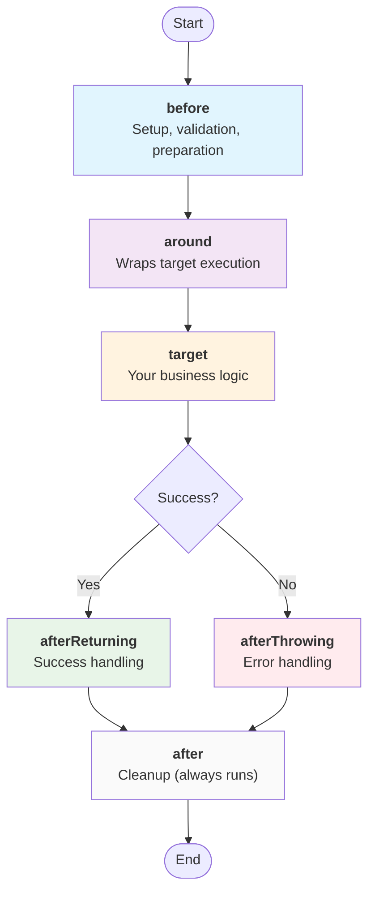

# Promise-AOP

**Latest version: v3.0.0**

A TypeScript-first AOP (Aspect-Oriented Programming) framework for clean, maintainable async code. Write cross-cutting concerns once, apply them everywhere.

- ✨ **Type-safe**: Full TypeScript support with intelligent context inference
- 🔒 **Section-based locking**: Safe concurrent access to shared context
- 🎯 **Flexible composition**: Before, around, after advice with dependency ordering
- 🛡️ **Robust error handling**: Structured error classification and recovery strategies
- 📦 **Zero dependencies**: Lightweight with full ESM/CJS support

[한국어 문서 (Korean Documentation)](./docs/README-ko.md)

---

## 📦 Installation

```bash
# npm
npm install @h1y/promise-aop

# yarn
yarn add @h1y/promise-aop

# pnpm
pnpm add @h1y/promise-aop
```

**Requirements**: Node.js 16+ (uses AsyncLocalStorage)

---

## 🚀 Quick Start

Get up and running in 5 minutes with a simple logging example:

```typescript
import { createAspect, createProcess, runProcess } from "@h1y/promise-aop";

// Step 1: Create an aspect that handles logging
const LoggingAspect = createAspect<string, { logger: Console }>(
  (createAdvice) => ({
    name: "logging",
    before: createAdvice({
      use: ["logger"],
      advice: async ({ logger }) => logger.info("🚀 Starting operation..."),
    }),
    after: createAdvice({
      use: ["logger"],
      advice: async ({ logger }) => logger.info("✅ Operation completed!"),
    }),
  }),
);

// Step 2: Create a process that combines aspects
const process = createProcess<string, { logger: Console }>({
  aspects: [LoggingAspect],
});

// Step 3: Run your target function with the process
const result = await runProcess({
  process,
  context: () => ({ logger: console }),
  target: async () => {
    // Your actual business logic here
    await new Promise((resolve) => setTimeout(resolve, 100));
    return "Hello, AOP World!";
  },
});

console.log(result); // "Hello, AOP World!"

// Output:
// 🚀 Starting operation...
// ✅ Operation completed!
```

**What just happened?**

1. We created a **logging aspect** that runs before and after any function
2. We **composed it into a process** that can be applied to any target
3. We **ran our business logic** with automatic logging applied

---

## 💡 Why Promise-AOP?

### The Problem

Without AOP, cross-cutting concerns like logging, authentication, and error handling get scattered throughout your codebase:

```typescript
// ❌ Scattered concerns - hard to maintain
async function getUserData(userId: string) {
  console.log("🚀 Starting getUserData..."); // Logging

  if (!isAuthenticated()) {
    // Auth
    throw new Error("Unauthorized");
  }

  try {
    const start = Date.now(); // Metrics
    const data = await database.query(userId);
    metrics.record("getUserData", Date.now() - start);

    console.log("✅ getUserData completed!"); // More logging
    return data;
  } catch (error) {
    logger.error("getUserData failed:", error); // Error handling
    throw error;
  }
}
```

### The Solution

With Promise-AOP, separate your concerns cleanly:

```typescript
// ✅ Clean separation - business logic is pure
const getUserData = async (userId: string) => {
  return database.query(userId); // Pure business logic
};

// Apply logging, auth, metrics automatically
const result = await runProcess({
  process: createProcess({
    aspects: [LoggingAspect, AuthAspect, MetricsAspect],
  }),
  context: () => ({ logger: console, auth, metrics, database }),
  target: getUserData,
});
```

**When to use Promise-AOP:**

- 🔐 **Authentication/Authorization** across multiple endpoints
- 📊 **Logging and metrics** collection
- ⚡ **Caching** expensive operations
- 🔄 **Retry logic** for unreliable services
- 🛡️ **Error handling and recovery**
- ⏱️ **Performance monitoring**

---

## 🧠 Core Concepts

### Advice Types

Promise-AOP supports five types of advice that run at different points in your function's lifecycle:

```typescript
const MyAspect = createAspect<Result, Context>((createAdvice) => ({
  name: "example",

  // 1. Before - setup and validation
  before: createAdvice({
    use: ["auth"],
    advice: async ({ auth }) => {
      if (!auth.isValid()) throw new Error("Unauthorized");
    },
  }),

  // 2. Around - wrap the entire execution
  around: createAdvice({
    use: ["cache"],
    advice: async ({ cache }, { attachToTarget }) => {
      attachToTarget((target) => async () => {
        const cached = await cache.get("key");
        if (cached) return cached;

        const result = await target();
        await cache.set("key", result);
        return result;
      });
    },
  }),

  // 3. AfterReturning - success handling
  afterReturning: createAdvice({
    use: ["logger"],
    advice: async ({ logger }, result) => {
      logger.info("Success:", result);
    },
  }),

  // 4. AfterThrowing - error handling
  afterThrowing: createAdvice({
    use: ["logger"],
    advice: async ({ logger }, error) => {
      logger.error("Failed:", error);
    },
  }),

  // 5. After - cleanup (always runs)
  after: createAdvice({
    use: ["metrics"],
    advice: async ({ metrics }) => {
      metrics.increment("operation_completed");
    },
  }),
}));
```

### Execution Flow



### Context & Section-Based Access

Context is your shared state, divided into named sections for safe concurrent access:

```typescript
type MyContext = {
  database: { query: (sql: string) => Promise<any> };
  logger: Console;
  cache: { get: (k: string) => any; set: (k: string, v: any) => void };
  auth: { userId: string; isAdmin: boolean };
};

const DatabaseAspect = createAspect<any, MyContext>((createAdvice) => ({
  name: "database",
  before: createAdvice({
    use: ["database", "auth"], // Declare which sections you need
    advice: async ({ database, auth }) => {
      // Only database and auth are available here
      // This prevents accidental coupling and enables safe parallelism
    },
  }),
}));
```

### Dependency-Based Ordering

Control execution order when multiple aspects affect the same advice phase:

```typescript
const AuthAspect = createAspect<any, Context>((createAdvice) => ({
  name: "auth",
  before: createAdvice({
    use: ["auth"],
    advice: async ({ auth }) => {
      // Validate user permissions
    },
  }),
}));

const LoggingAspect = createAspect<any, Context>((createAdvice) => ({
  name: "logging",
  before: createAdvice({
    use: ["logger"],
    dependsOn: ["auth"], // Run after auth aspect
    advice: async ({ logger }) => {
      logger.info("User authenticated, starting operation");
    },
  }),
}));
```

---

## 📚 Common Patterns

### Authentication & Authorization

```typescript
const AuthAspect = createAspect<
  any,
  {
    auth: { token: string; validate: (token: string) => Promise<boolean> };
    logger: Console;
  }
>((createAdvice) => ({
  name: "auth",
  before: createAdvice({
    use: ["auth", "logger"],
    advice: async ({ auth, logger }) => {
      const isValid = await auth.validate(auth.token);
      if (!isValid) {
        logger.warn("Authentication failed");
        throw new Error("Unauthorized access");
      }
      logger.info("User authenticated successfully");
    },
  }),
}));
```

### Caching with Around Advice

```typescript
const CacheAspect = createAspect<
  any,
  {
    cache: {
      get: (key: string) => Promise<any>;
      set: (key: string, value: any) => Promise<void>;
    };
  }
>((createAdvice) => ({
  name: "cache",
  around: createAdvice({
    use: ["cache"],
    advice: async ({ cache }, { attachToTarget }) => {
      attachToTarget((target) => async () => {
        const cacheKey = "operation_result";

        // Try cache first
        const cached = await cache.get(cacheKey);
        if (cached) return cached;

        // Execute target and cache result
        const result = await target();
        await cache.set(cacheKey, result);
        return result;
      });
    },
  }),
}));
```

### Error Handling & Recovery

```typescript
const ErrorHandlingAspect = createAspect<
  string,
  {
    logger: Console;
    fallback: { getValue: () => string };
  }
>((createAdvice) => ({
  name: "error-handling",
  afterThrowing: createAdvice({
    use: ["logger"],
    advice: async ({ logger }, error) => {
      logger.error("Operation failed:", error);
      // Log error details, send to monitoring service, etc.
    },
  }),
}));

// Configure error recovery at the process level
const process = createProcess({
  aspects: [ErrorHandlingAspect],
  processOptions: {
    resolveHaltRejection: async (context, exit, error) => {
      // Return a fallback target function
      return async () => {
        const fallback = context().fallback;
        return fallback.getValue();
      };
    },
  },
});
```

### Metrics & Performance Monitoring

```typescript
const MetricsAspect = createAspect<
  any,
  {
    metrics: {
      startTimer: (name: string) => void;
      endTimer: (name: string) => void;
      increment: (name: string) => void;
    };
  }
>((createAdvice) => ({
  name: "metrics",
  before: createAdvice({
    use: ["metrics"],
    advice: async ({ metrics }) => {
      metrics.startTimer("operation_duration");
    },
  }),
  afterReturning: createAdvice({
    use: ["metrics"],
    advice: async ({ metrics }) => {
      metrics.endTimer("operation_duration");
      metrics.increment("operation_success");
    },
  }),
  afterThrowing: createAdvice({
    use: ["metrics"],
    advice: async ({ metrics }) => {
      metrics.endTimer("operation_duration");
      metrics.increment("operation_failure");
    },
  }),
}));
```

---

## 🔧 Advanced Examples

### Complex Around Advice: Dual Attachment Points

The around advice provides two attachment points for sophisticated wrapper composition:

```typescript
const AdvancedCacheAspect = createAspect<
  number,
  {
    cache: {
      get: (k: string) => Promise<number | null>;
      set: (k: string, v: number) => Promise<void>;
    };
    logger: Console;
  }
>((createAdvice) => ({
  name: "advanced-cache",
  around: createAdvice({
    use: ["cache", "logger"],
    advice: async ({ cache, logger }, { attachToTarget, attachToResult }) => {
      // attachToTarget: Wraps the original target function
      // Executes closest to the actual target
      attachToTarget((target) => async () => {
        logger.info("🎯 Target wrapper: Checking cache...");
        const cached = await cache.get("data");
        if (cached) {
          logger.info("💾 Cache hit!");
          return cached;
        }

        logger.info("🔍 Cache miss, executing target...");
        const result = await target();
        await cache.set("data", result);
        return result;
      });

      // attachToResult: Wraps the entire execution chain
      // Executes outermost, after all target wrappers
      attachToResult((target) => async () => {
        logger.info("🌟 Result wrapper: Starting execution...");
        const start = Date.now();
        const result = await target();
        const duration = Date.now() - start;
        logger.info(`⚡ Result wrapper: Completed in ${duration}ms`);
        return result * 2; // Transform the final result
      });
    },
  }),
}));

// Execution flow for target value 5:
// 🌟 Result wrapper: Starting execution...
// 🎯 Target wrapper: Checking cache...
// 🔍 Cache miss, executing target...
// [original target executes: 5]
// ⚡ Result wrapper: Completed in 123ms
// Final result: 10 (5 * 2 from result wrapper)
```

### AsyncContext Integration

Promise-AOP provides seamless AsyncContext integration for better context management:

```typescript
import { AsyncContext, createProcess, runProcess } from "@h1y/promise-aop";

// Create an AsyncContext with your shared data
const asyncContext = AsyncContext.create(() => ({
  userId: "12345",
  logger: console,
  database: myDatabase,
  requestId: crypto.randomUUID(),
}));

// Use with runProcess (automatic context propagation)
const result = await runProcess({
  process: myProcess,
  context: asyncContext, // Pass AsyncContext directly
  target: async () => "Hello World",
});

// Or use AsyncContext.execute for manual control
const manualResult = await AsyncContext.execute(
  asyncContext,
  (getContext, exit) =>
    myProcess(getContext, exit, async () => "Manual execution"),
);
```

### Multiple Aspects Composition

```typescript
const AuthAspect = createAspect<ApiResponse, AppContext>((createAdvice) => ({
  name: "auth",
  before: createAdvice({
    use: ["auth"],
    advice: async ({ auth }) => {
      if (!auth.isAuthenticated()) throw new Error("Please log in");
    },
  }),
}));

const CacheAspect = createAspect<ApiResponse, AppContext>((createAdvice) => ({
  name: "cache",
  around: createAdvice({
    use: ["cache"],
    advice: async ({ cache }, { attachToTarget }) => {
      attachToTarget((target) => async () => {
        const key = "api_response";
        const cached = await cache.get(key);
        if (cached) return cached;

        const result = await target();
        await cache.set(key, result, { ttl: 300 });
        return result;
      });
    },
  }),
}));

const LoggingAspect = createAspect<ApiResponse, AppContext>((createAdvice) => ({
  name: "logging",
  before: createAdvice({
    use: ["logger"],
    dependsOn: ["auth"], // Log only after successful auth
    advice: async ({ logger }) => logger.info("🚀 API request started"),
  }),
  after: createAdvice({
    use: ["logger"],
    advice: async ({ logger }) => logger.info("✅ API request completed"),
  }),
}));

// Compose all aspects together
const apiProcess = createProcess<ApiResponse, AppContext>({
  aspects: [AuthAspect, CacheAspect, LoggingAspect],
});
```

---

## 🛡️ Error Handling Strategy

Promise-AOP provides a structured approach to error handling with three types of rejections:

### Rejection Types

```typescript
import {
  Rejection,
  HaltRejection,
  ContinuousRejection,
} from "@h1y/promise-aop";

// Base class for all AOP errors
const rejection = new Rejection({
  error: new Error("Something went wrong"),
  extraInfo: {
    type: "advice", // "target" | "advice" | "unknown"
    advice: someAdvice, // Present when type is "advice"
  },
});

// Critical error that stops the entire chain
const haltRejection = new HaltRejection({
  error: new Error("Authentication failed"),
  extraInfo: { type: "advice", advice: authAdvice },
});

// Non-critical error that gets collected but doesn't stop execution
const continuousRejection = new ContinuousRejection({
  error: new Error("Metrics collection failed"),
  extraInfo: { type: "advice", advice: metricsAdvice },
});
```

### Error Resolution Strategy

Configure how your application handles different types of errors:

```typescript
const robustProcess = createProcess({
  aspects: [AuthAspect, CacheAspect, MetricsAspect],
  processOptions: {
    // Handle critical errors that halt execution
    resolveHaltRejection: async (context, exit, error) => {
      const { logger, fallback } = context();
      logger.error("Critical failure:", error.info.error.message);

      // Return a fallback target function
      return async () => ({
        success: false,
        fallback: true,
        timestamp: Date.now(),
        data: fallback.defaultValue,
      });
    },

    // Handle non-critical errors that were collected
    resolveContinuousRejection: async (context, exit, errors) => {
      const { logger, monitoring } = context();

      errors.forEach((error) => {
        logger.warn("Non-critical error:", error.info.error.message);
        monitoring.recordError(error);
      });
    },
  },
});
```

### Error Source Tracking

Each rejection includes detailed metadata about its origin:

- **`type: "target"`**: Error came from your business logic
- **`type: "advice"`**: Error came from a specific aspect (includes advice reference)
- **`type: "unknown"`**: Error came from an unexpected source

### Advanced Error Handling Pattern

```typescript
const RobustApiAspect = createAspect<ApiResponse, AppContext>((createAdvice) => ({
  name: "robust-api",
  before: createAdvice({
    use: ["auth", "logger", "monitoring"],
    advice: async ({ auth, logger, monitoring }) => {
      try {
        const isValid = await auth.validateToken();
        if (!isValid) {
          // Critical error - halt the chain
          throw new HaltRejection({
            error: new Error("Invalid authentication token"),
            extraInfo: { type: "advice", advice: /* current advice */ }
          });
        }
      } catch (error) {
        if (error instanceof HaltRejection) throw error;

        // Non-critical monitoring failure - continue execution
        try {
          monitoring.recordAuthAttempt(false);
        } catch (monitoringError) {
          throw new ContinuousRejection({
            error: monitoringError,
            extraInfo: { type: "advice", advice: /* current advice */ }
          });
        }

        throw error; // Re-throw original error
      }
    },
  }),
}));
```

---

## 📚 Complete API Reference

### Core Functions

| Function                                 | Description                                  | Returns                    |
| ---------------------------------------- | -------------------------------------------- | -------------------------- |
| `createAspect<Result, Context>(helper)`  | Create an aspect with cross-cutting concerns | `Aspect<Result, Context>`  |
| `createProcess<Result, Context>(config)` | Compose aspects into executable process      | `Process<Result, Context>` |
| `runProcess<Result, Context>(props)`     | Execute process with context and target      | `Promise<Result>`          |

### Exported Classes

| Class                   | Description                                     | Usage                                       |
| ----------------------- | ----------------------------------------------- | ------------------------------------------- |
| `Rejection`             | Base error class for all AOP rejections         | Custom rejection handling                   |
| `HaltRejection`         | Error that halts the entire advice chain        | Critical errors requiring chain halt        |
| `ContinuousRejection`   | Error that continues execution with aggregation | Non-critical errors for collection          |
| `AsyncContext<Context>` | Async context management utility                | Context propagation across async operations |

### Core Types

```typescript
// Your target function type
type Target<Result> = () => Promise<Result>;

// Wrapper function for around advice
type TargetWrapper<Result> = (target: Target<Result>) => Target<Result>;

// Compiled executable process
type Process<Result, SharedContext> = (
  context: ContextAccessor<SharedContext>,
  exit: ExecutionOuterContext,
  target: Target<Result>,
) => Promise<Result>;

// Aspect definition
type Aspect<Result, Context> = {
  readonly name: string;
  readonly before?: AdviceMetadata<Result, Context, "before">;
  readonly around?: AdviceMetadata<Result, Context, "around">;
  readonly afterReturning?: AdviceMetadata<Result, Context, "afterReturning">;
  readonly afterThrowing?: AdviceMetadata<Result, Context, "afterThrowing">;
  readonly after?: AdviceMetadata<Result, Context, "after">;
};

// Advice metadata with context access control
type AdviceMetadata<Result, Context, AdviceType, Sections> = {
  readonly use?: Sections; // Declared context sections
  readonly dependsOn?: readonly string[]; // Aspect dependencies
  readonly advice: AdviceFunctionWithContext<Result, Context, AdviceType>;
};
```

### Configuration Options

```typescript
// Build-time configuration per advice type
type BuildOptions = {
  advice: {
    [advice in Advice]: {
      execution: "parallel" | "sequential";
      error: {
        aggregation: "unit" | "all";
        runtime: {
          afterThrow: "halt" | "continue";
        };
      };
    };
  };
};

// Process-level error resolution
type ProcessOptions<Result, SharedContext> = {
  resolveHaltRejection?: (
    context: ContextAccessor<SharedContext>,
    exit: ExecutionOuterContext,
    error: HaltRejection,
  ) => Promise<Target<Result>>;

  resolveContinuousRejection?: (
    context: ContextAccessor<SharedContext>,
    exit: ExecutionOuterContext,
    errors: ContinuousRejection[],
  ) => Promise<void>;
};
```

### Default Configuration

| Advice Type      | Execution    | Error Aggregation | Error Runtime |
| ---------------- | ------------ | ----------------- | ------------- |
| `before`         | `parallel`   | `unit`            | `halt`        |
| `around`         | `sequential` | `unit`            | `halt`        |
| `afterReturning` | `parallel`   | `all`             | `continue`    |
| `afterThrowing`  | `parallel`   | `all`             | `continue`    |
| `after`          | `parallel`   | `all`             | `continue`    |

---

## 🔬 Advanced Topics

### Error Configuration Deep Dive

Understanding Promise-AOP's error handling configuration is crucial for building robust applications. Let's break down the key concepts:

#### Error Aggregation: `unit` vs `all`

**Error Aggregation** determines how multiple errors within the same advice phase are collected and processed:

```typescript
// Error Aggregation: "unit"
// - First error stops execution immediately
// - Only one error is captured and processed
// - Default for: before, around

// Error Aggregation: "all"
// - Collects all errors that occur within the phase
// - All advice in the phase attempt to run despite individual failures
// - All errors are gathered and processed together
// - Default for: after, afterReturning, afterThrowing
```

**Practical Example:**

```typescript
const LoggingAspects = [
  createAspect<any, { logger: Console }>((createAdvice) => ({
    name: "file-logger",
    after: createAdvice({
      use: ["logger"],
      advice: async ({ logger }) => {
        throw new Error("File logging failed"); // Error 1
      },
    }),
  })),
  createAspect<any, { logger: Console }>((createAdvice) => ({
    name: "email-logger",
    after: createAdvice({
      use: ["logger"],
      advice: async ({ logger }) => {
        throw new Error("Email logging failed"); // Error 2
      },
    }),
  })),
];

const process = createProcess({
  aspects: LoggingAspects,
  buildOptions: {
    advice: {
      after: {
        execution: "parallel",
        error: {
          aggregation: "all", // ✅ Both errors will be collected
          runtime: { afterThrow: "continue" },
        },
      },
    },
  },
});

// Result: Both errors are passed to resolveContinuousRejection
// If aggregation was "unit", only the first error would be captured
```

#### Error Runtime: `halt` vs `continue`

**Error Runtime** (`afterThrow`) determines what happens when an advice throws an error:

```typescript
// Error Runtime: "halt"
// - Error stops the entire advice chain immediately
// - Triggers resolveHaltRejection
// - Target may not execute if error occurs in before/around
// - Default for: before, around

// Error Runtime: "continue"
// - Error is collected but doesn't stop execution
// - Chain continues to next phase
// - Collected errors are passed to resolveContinuousRejection
// - Default for: after, afterReturning, afterThrowing
```

**Practical Example:**

```typescript
const CriticalAspect = createAspect<string, { auth: Auth }>((createAdvice) => ({
  name: "critical-auth",
  before: createAdvice({
    use: ["auth"],
    advice: async ({ auth }) => {
      if (!auth.isValid()) {
        throw new Error("Authentication failed"); // This will HALT
      }
    },
  }),
}));

const NonCriticalAspect = createAspect<string, { metrics: Metrics }>(
  (createAdvice) => ({
    name: "metrics",
    after: createAdvice({
      use: ["metrics"],
      advice: async ({ metrics }) => {
        throw new Error("Metrics failed"); // This will CONTINUE
      },
    }),
  }),
);

const process = createProcess({
  aspects: [CriticalAspect, NonCriticalAspect],
  // CriticalAspect uses default "halt" -> stops everything on auth failure
  // NonCriticalAspect uses default "continue" -> error collected but chain continues
});
```

#### Configuration Matrix

| Advice Phase     | Default Execution | Default Aggregation | Default Runtime | Why?                                        |
| ---------------- | ----------------- | ------------------- | --------------- | ------------------------------------------- |
| `before`         | `parallel`        | `unit`              | `halt`          | Setup failures should stop execution        |
| `around`         | `sequential`      | `unit`              | `halt`          | Wrapper failures are critical               |
| `afterReturning` | `parallel`        | `all`               | `continue`      | Success logging shouldn't break results     |
| `afterThrowing`  | `parallel`        | `all`               | `continue`      | Error logging shouldn't hide original error |
| `after`          | `parallel`        | `all`               | `continue`      | Cleanup failures shouldn't affect results   |

#### Custom Error Behavior

You can override defaults for specific needs:

```typescript
const customProcess = createProcess({
  aspects: [MyAspect],
  buildOptions: {
    advice: {
      // Make after phase halt on error (unusual but possible)
      after: {
        execution: "parallel",
        error: {
          aggregation: "unit", // Stop on first cleanup error
          runtime: { afterThrow: "halt" }, // Halt chain on cleanup failure
        },
      },
      // Make before phase continue on error (collect validation errors)
      before: {
        execution: "parallel",
        error: {
          aggregation: "all", // Collect all validation errors
          runtime: { afterThrow: "continue" }, // Don't halt, continue with errors
        },
      },
    },
  },
});
```

### Section Locking & Conflict Resolution

Promise-AOP prevents concurrent access to the same context section within parallel advice execution:

```typescript
// ❌ This will cause a section conflict
const ConflictingAspects = [
  createAspect<any, { db: Database }>((createAdvice) => ({
    name: "aspect-a",
    before: createAdvice({
      use: ["db"], // Both aspects want db access
      advice: async ({ db }) => {
        /* ... */
      },
    }),
  })),
  createAspect<any, { db: Database }>((createAdvice) => ({
    name: "aspect-b",
    before: createAdvice({
      use: ["db"], // Both aspects want db access
      advice: async ({ db }) => {
        /* ... */
      },
    }),
  })),
];

// ✅ Resolution strategies:

// Option 1: Sequential execution
const process = createProcess({
  aspects: ConflictingAspects,
  buildOptions: {
    advice: {
      before: { execution: "sequential" }, // Run before advice sequentially
    },
  },
});

// Option 2: Dependency ordering
const OrderedAspect = createAspect<any, { db: Database }>((createAdvice) => ({
  name: "aspect-b",
  before: createAdvice({
    use: ["db"],
    dependsOn: ["aspect-a"], // Run after aspect-a
    advice: async ({ db }) => {
      /* ... */
    },
  }),
}));
```

### Around Advice Composition Mechanics

Understanding the execution order of multiple wrappers:

```typescript
const CompositionExample = createAspect<number, { log: Console }>(
  (createAdvice) => ({
    name: "composition",
    around: createAdvice({
      use: ["log"],
      advice: async ({ log }, { attachToTarget, attachToResult }) => {
        // Target wrappers: Last attached executes outermost among target wrappers
        attachToTarget((target) => async () => {
          log.info("Target wrapper 1: before");
          const result = await target();
          log.info("Target wrapper 1: after");
          return result + 100;
        });

        attachToTarget((target) => async () => {
          log.info("Target wrapper 2: before"); // This runs first (outer)
          const result = await target();
          log.info("Target wrapper 2: after"); // This runs last (outer)
          return result + 10;
        });

        // Result wrappers: Last attached executes outermost among result wrappers
        attachToResult((target) => async () => {
          log.info("Result wrapper 1: before");
          const result = await target();
          log.info("Result wrapper 1: after");
          return result * 2;
        });

        attachToResult((target) => async () => {
          log.info("Result wrapper 2: before"); // This runs first (outer)
          const result = await target();
          log.info("Result wrapper 2: after"); // This runs last (outer)
          return result * 3;
        });
      },
    }),
  }),
);

// Execution order for target value 5:
// Result wrapper 2: before    (outermost result wrapper)
// Result wrapper 1: before
// Target wrapper 2: before    (outermost target wrapper)
// Target wrapper 1: before
// [original target: 5]
// Target wrapper 1: after     → 5 + 100 = 105
// Target wrapper 2: after     → 105 + 10 = 115
// Result wrapper 1: after     → 115 * 2 = 230
// Result wrapper 2: after     → 230 * 3 = 690
```

### Performance Optimization

#### Minimize Context Sections

```typescript
// ❌ Over-broad context access
const InefficientAspect = createAspect<any, LargeContext>((createAdvice) => ({
  name: "inefficient",
  before: createAdvice({
    use: ["db", "cache", "logger", "auth", "metrics"], // Too many sections
    advice: async (context) => {
      // Only uses logger
      context.logger.info("Starting operation");
    },
  }),
}));

// ✅ Minimal context access
const EfficientAspect = createAspect<any, LargeContext>((createAdvice) => ({
  name: "efficient",
  before: createAdvice({
    use: ["logger"], // Only what you need
    advice: async ({ logger }) => {
      logger.info("Starting operation");
    },
  }),
}));
```

#### Batch Operations in Sequential Mode

```typescript
// When you must use sequential execution, batch operations:
const BatchedDatabaseAspect = createAspect<any, { db: Database }>(
  (createAdvice) => ({
    name: "batched-db",
    before: createAdvice({
      use: ["db"],
      advice: async ({ db }) => {
        // Batch multiple operations into a single database call
        await db.executeBatch([
          "INSERT INTO audit_log (event) VALUES ('operation_started')",
          "UPDATE stats SET operations = operations + 1",
          "DELETE FROM temp_cache WHERE expires_at < NOW()",
        ]);
      },
    }),
  }),
);
```

### AsyncContext Deep Dive

AsyncContext provides automatic context propagation through async operations:

```typescript
import { AsyncContext } from "@h1y/promise-aop";

// Create context that persists across async boundaries
const requestContext = AsyncContext.create(() => ({
  requestId: crypto.randomUUID(),
  userId: getCurrentUserId(),
  startTime: Date.now(),
}));

// Context automatically flows through all async operations
await AsyncContext.execute(requestContext, async (getContext) => {
  const { requestId } = getContext();

  // All nested async calls inherit the same context
  await someAsyncOperation(); // Has access to requestId
  await anotherAsyncOperation(); // Also has access to requestId

  // Even setTimeout preserves context
  setTimeout(() => {
    const { requestId: sameId } = getContext();
    console.log(sameId); // Same requestId!
  }, 1000);
});
```

---

## 🔧 Development

```bash
# Install dependencies
yarn install

# Run tests
yarn test

# Run tests in watch mode
yarn test --watch

# Type checking
yarn check-types

# Build the library
yarn build

# Lint code
yarn lint

# Format code
yarn format
```

### Project Structure

```
src/
├── index.ts                    # Public API exports
├── createAspect.ts            # Aspect creation
├── createProcess.ts           # Process compilation
├── runProcess.ts              # Process execution
└── lib/
    ├── models/                # Type definitions
    ├── features/              # Core functionality
    │   ├── chaining/         # Advice chain execution
    │   ├── organizing/       # Aspect organization
    │   └── processing/       # Advice processing
    └── utils/                # Utility functions
```

---

## 🧱 Compatibility

- **Node.js**: 16.0.0 or higher (requires AsyncLocalStorage)
- **TypeScript**: 4.7.0 or higher
- **Module Systems**: ESM and CommonJS via export maps
- **Browsers**: Modern browsers with async/await support

### Bundle Size

- **ESM**: ~15KB minified
- **CommonJS**: ~16KB minified
- **Zero runtime dependencies**

---

## 🤝 Contributing

We welcome contributions! Here's how to get started:

### Development Setup

1. **Fork and clone** the repository
2. **Install dependencies**: `yarn install`
3. **Run tests**: `yarn test`
4. **Make your changes**
5. **Add tests** for new functionality
6. **Ensure all tests pass**: `yarn test`
7. **Check types**: `yarn check-types`
8. **Lint your code**: `yarn lint`

### Contribution Guidelines

- **Write tests** for all new features and bug fixes
- **Follow TypeScript best practices** with strict type checking
- **Add documentation** for new APIs or significant changes
- **Keep commits atomic** and write clear commit messages
- **Update CHANGELOG.md** for user-facing changes

### Reporting Issues

When reporting bugs, please include:

- **Minimal reproduction** example
- **Expected vs actual behavior**
- **Environment details** (Node.js version, TypeScript version)
- **Stack traces** when applicable

---

## 📝 License

MIT © [h1ylabs](https://github.com/h1ylabs)

---

## 🙏 Acknowledgments

Promise-AOP is inspired by:

- **Spring AOP** - for aspect-oriented programming concepts
- **AsyncLocalStorage** - for context propagation patterns
- **TypeScript** - for making JavaScript development enjoyable

---

**Happy coding with Promise-AOP! 🚀**
