# Promise-AOP

**Latest version: v4.0.0**

A TypeScript-first, zero-dependency AOP (Aspect-Oriented Programming) framework for robust and maintainable asynchronous code. It provides a structured way to manage cross-cutting concerns like logging, caching, and error handling with a strong emphasis on type safety and explicit context management.

[한국어 문서 (Korean Documentation)](./docs/README-ko.md)

## 🏗️ Architecture Overview

Promise-AOP follows a clear execution model where **Aspects** define cross-cutting concerns, **Processes** compile them into execution chains, and **Context** provides thread-safe data access.

```mermaid
flowchart TD
    A["🎯 Target Function<br/>(Your Business Logic)"] 
    B["📦 Aspect<br/>(Cross-cutting Concern)"]
    C["⚙️ Process<br/>(Compiled Execution Chain)"]
    D["🔄 runProcess<br/>(Execute with Context)"]
    E["📊 Context<br/>(Shared Data)"]
    
    B --> C
    A --> D
    C --> D
    E --> D
    
    subgraph "Advice Types"
        F["before"]
        G["around"]
        H["after"]
        I["afterReturning"]
        J["afterThrowing"]
    end
    
    B --> F
    B --> G
    B --> H
    B --> I
    B --> J
```



### Execution Flow


---

## 📦 Installation

```bash
# npm
npm install @h1y/promise-aop

# yarn
yarn add @h1y/promise-aop

# pnpm
pnpm add @h1y/promise-aop
```

**Requirements**: Node.js 16+ (uses `AsyncLocalStorage`)

---

## 🚀 Quick Start

This example demonstrates a simple logging aspect applied to a business logic function.

```typescript
import { createAspect, createProcess, runProcess } from "@h1y/promise-aop";

// Define shared context for your application
type AppContext = { logger: Console };

// 1. Create an Aspect for a cross-cutting concern (e.g., logging)
const LoggingAspect = createAspect<string, AppContext>((createAdvice) => ({
  name: "logging",
  before: createAdvice({
    use: ["logger"], // Declare which parts of the context you need
    advice: async ({ logger }) => logger.info("🚀 Starting operation..."),
  }),
  after: createAdvice({
    use: ["logger"],
    advice: async ({ logger }) => logger.info("✅ Operation completed!"),
  }),
}));

// 2. Create a Process to compose your aspects
const process = createProcess<string, AppContext>({ aspects: [LoggingAspect] });

// 3. Run your target function with the process
const result = await runProcess({
  process,
  context: () => ({ logger: console }),
  target: async () => {
    // Your actual business logic
    await new Promise((resolve) => setTimeout(resolve, 100));
    return "Hello, AOP World!";
  },
});

console.log(result); // "Hello, AOP World!"

// Console Output:
// 🚀 Starting operation...
// ✅ Operation completed!
```

**What happened here?**

1. **Aspect Definition**: Created a reusable logging concern with `before` and `after` advice
2. **Process Compilation**: Combined aspects into an executable process  
3. **Context Provision**: Provided shared services (logger) to all aspects
4. **Automatic Weaving**: Framework automatically executed advice around your target function
```

---

## 🧐 Understanding AOP Concepts

Before diving into Promise-AOP, let's understand the core concepts:

### What is Aspect-Oriented Programming?

**Aspect-Oriented Programming (AOP)** is a programming paradigm that separates **cross-cutting concerns** (like logging, security, caching) from your main business logic.


### Key Terminology

| Term | Definition | Example |
|------|------------|----------|
| **Aspect** | A modular unit that encapsulates a cross-cutting concern | `LoggingAspect`, `CachingAspect` |
| **Advice** | The actual code that gets executed (when/how/where) | `before`, `after`, `around` |
| **Target** | Your original business function | `getUserById()`, `processPayment()` |
| **Context** | Shared data/services available to all aspects | `{ logger, db, metrics }` |
| **Process** | Compiled execution chain of aspects + target | Result of `createProcess()` |

### Context & Section-Based Access

Promise-AOP uses a **section-based context system** for thread-safe access:

```mermaid
graph TD
    A["Context: { logger, db, metrics, cache }"] 
    B["Aspect A<br/>use: ['logger']"] 
    C["Aspect B<br/>use: ['db', 'metrics']"] 
    D["Aspect C<br/>use: ['cache']"] 
    
    A --> B
    A --> C
    A --> D
    
    E["✅ Parallel Execution<br/>(No overlapping sections)"]
    B --> E
    C --> E
    D --> E
```



## ✨ Why Promise-AOP?

Promise-AOP helps you decouple cross-cutting concerns from your core business logic, leading to cleaner, more maintainable, and testable code.

**Before: Scattered Concerns**

```typescript
// Business logic is cluttered with logging, metrics, and error handling
async function getUser(id: string) {
  logger.info(`Fetching user ${id}...`);
  const startTime = Date.now();
  try {
    const user = await db.fetchUser(id);
    metrics.record("user.fetch.success", Date.now() - startTime);
    return user;
  } catch (e) {
    logger.error(`Failed to fetch user ${id}`, e);
    metrics.record("user.fetch.failure", Date.now() - startTime);
    throw e;
  }
}
```

**After: Clean Separation**

```typescript
// Pure business logic, easy to read and test
const fetchUser = async (id: string) => db.fetchUser(id);

// Apply concerns declaratively
const processedGetUser = (id: string) => runProcess({
  process: createProcess({ aspects: [LoggingAspect, MetricsAspect] }),
  context: () => ({ logger, metrics, db }),
  target: async () => fetchUser(id),
});
```

**Key Benefits:**

-   **Separation of Concerns**: Isolate business logic from infrastructure code.
-   **Type Safety**: Full TypeScript support with intelligent context inference.
-   **Section-Based Locking**: Safe concurrent access to shared context.
-   **Reduced Boilerplate**: Define concerns once, apply everywhere.
-   **Centralized Control**: Manage application-wide policies in one place.
-   **Enhanced Testability**: Test core logic without mocking unrelated services.

---

## 📚 API Reference

### Core Functions

#### `createAspect<Result, Context>(factory)`

Creates an aspect, which is a modular unit for a cross-cutting concern.

**Type Parameters:**
- `Result`: The expected return type of the target function
- `Context`: A shared object available to all advice (dictionary-like type where keys are section names)

**Parameters:**
- `factory`: `(createAdvice: AdviceGeneratorHelper<Result, Context>) => Aspect<Result, Context>`

**Returns:** `Aspect<Result, Context>`

```typescript
type Aspect<Result, Context> = {
  readonly name: string;
  readonly before?: AdviceMetadata<Result, Context, 'before'>;
  readonly around?: AdviceMetadata<Result, Context, 'around'>;
  readonly afterReturning?: AdviceMetadata<Result, Context, 'afterReturning'>;
  readonly afterThrowing?: AdviceMetadata<Result, Context, 'afterThrowing'>;
  readonly after?: AdviceMetadata<Result, Context, 'after'>;
};
```

#### `createAdvice(metadata)` Helper

The `createAdvice` helper function defines the behavior of a single piece of advice.

```typescript
type AdviceMetadata<Result, Context, AdviceType, Sections> = {
  readonly use?: Sections; // Array of context section names
  readonly dependsOn?: readonly string[]; // Array of aspect names
  readonly advice: AdviceFunctionWithContext<Result, Context, AdviceType>;
};
```

**Properties:**

| Property | Type | Description |
|----------|------|-------------|
| `use?` | `(keyof Context)[]` | Context sections this advice needs. Enables type checking and section-based locking. |
| `dependsOn?` | `string[]` | Aspect names this advice must run after (within same phase). |
| `advice` | `AdviceFunction` | The actual advice logic. Signature varies by advice type. |

#### Advice Function Signatures

| Advice Type | Signature | Purpose |
|-------------|-----------|---------|
| `before` | `(context: Restricted<Context, Sections>) => Promise<void>` | Setup, validation, preparation |
| `around` | `(context: Restricted<Context, Sections>, hooks: AroundHooks) => Promise<void>` | Wrapping, transformation, caching |
| `afterReturning` | `(context: Restricted<Context, Sections>, result: Result) => Promise<void>` | Success handling, cleanup |
| `afterThrowing` | `(context: Restricted<Context, Sections>, error: unknown) => Promise<void>` | Error handling, logging |
| `after` | `(context: Restricted<Context, Sections>) => Promise<void>` | Always runs, final cleanup |

**Around Advice Hooks:**
```typescript
type AroundHooks<Result> = {
  attachToTarget: (wrapper: TargetWrapper<Result>) => void;
  attachToResult: (wrapper: TargetWrapper<Result>) => void;
};

type TargetWrapper<Result> = (target: Target<Result>) => Target<Result>;
type Target<Result> = () => Promise<Result>;
```

#### `createProcess<Result, Context>(config)`

Compiles a set of aspects into an executable process.

**Type Parameters:**
- `Result`: Expected return type of target functions
- `Context`: Shared context type

**Parameters:**
```typescript
type CreateProcessConfig<Result, Context> = {
  readonly aspects: readonly Aspect<Result, Context>[];
  readonly buildOptions?: BuildOptions;
  readonly processOptions?: ProcessOptions<Result, Context>;
};
```

**Returns:** `Process<Result, Context>`

```typescript
type Process<Result, Context> = (
  context: ContextAccessor<Context>,
  exit: ExecutionOuterContext, 
  target: Target<Result>
) => Promise<Result>;
```

#### `runProcess<Result, Context>(props)`

Executes a process with a target function and context.

**Parameters:**
```typescript
type RunProcessProps<Result, Context> = {
  readonly process: Process<Result, Context>;
  readonly target: Target<Result>; // () => Promise<Result>
  readonly context: ContextGenerator<Context> | AsyncContext<Context>;
};

type ContextGenerator<Context> = () => Context;
```

**Returns:** `Promise<Result>`

**Context Types:**
- `ContextGenerator<Context>`: Simple function that returns context
- `AsyncContext<Context>`: For automatic propagation across async boundaries

**Example:**
```typescript
// Using context generator
const result = await runProcess({
  process,
  target: async () => fetchUserData(id),
  context: () => ({ logger: console, db })
});

// Using AsyncContext for propagation
const asyncCtx = AsyncContext.create(() => ({ logger, db }));
const result = await runProcess({
  process,
  target: async () => fetchUserData(id), 
  context: asyncCtx
});
```

### Configuration Options

#### `BuildOptions`

Controls execution strategy and error handling for each advice type.

```typescript
type BuildOptions = {
  readonly advice?: {
    readonly [AdviceType in Advice]?: {
      readonly execution?: ExecutionStrategy;
      readonly error?: {
        readonly aggregation?: AggregationUnit;
        readonly runtime?: {
          readonly afterThrow?: ErrorAfter;
        };
      };
    };
  };
};

type ExecutionStrategy = "parallel" | "sequential";
type AggregationUnit = "unit" | "all";
type ErrorAfter = "halt" | "continue";
```

**Default Configuration:**

| Advice Type | Execution | Aggregation | After Throw | Notes |
|-------------|-----------|-------------|-------------|-------|
| `before` | `parallel` | `unit` | `halt` | Fails fast on first error |
| `around` | `sequential` | `unit` | `halt` | Wraps in sequence |
| `afterReturning` | `parallel` | `all` | `continue` | Collects all errors |
| `afterThrowing` | `parallel` | `all` | `continue` | Collects all errors |
| `after` | `parallel` | `all` | `continue` | Always runs |

**Error Configuration Options:**
- `aggregation: "unit"`: Stop on first error
- `aggregation: "all"`: Collect all errors
- `afterThrow: "halt"`: Stop execution on error
- `afterThrow: "continue"`: Continue despite errors

**Section Locking:** If parallel advice use the same context sections, Promise-AOP throws a runtime error. Resolve by:
1. Making execution `sequential`
2. Setting `dependsOn` relationships
3. Using different context sections

#### `ProcessOptions`

Centralized error handling and recovery configuration.

```typescript
type ProcessOptions<Result, Context> = {
  readonly determineError?: (props: {
    context: ContextAccessor<Context>;
    exit: ExecutionOuterContext;
    errors: unknown[];
    info: ErrorInfo;
  }) => Promise<unknown>;
  
  readonly handleError?: (props: {
    context: ContextAccessor<Context>;
    exit: ExecutionOuterContext; 
    error: unknown;
  }) => Promise<Result>;
  
  readonly handleContinuedErrors?: (props: {
    context: ContextAccessor<Context>;
    exit: ExecutionOuterContext;
    errors: readonly (readonly [unknown[], ErrorInfo])[]; 
  }) => Promise<void>;
};
```

**Error Handling Flow:**


**Handler Descriptions:**

| Handler | Purpose | Return Behavior |
|---------|---------|-----------------|
| `determineError` | Select primary error from multiple failures | Returns the most important error |
| `handleError` | Core recovery logic | Return `Result` to recover, throw to fail |
| `handleContinuedErrors` | Handle secondary errors | For logging/monitoring only |

**Default Behavior:**
- `determineError`: Returns first error
- `handleError`: Re-throws error (no recovery)
- `handleContinuedErrors`: No-op

<details>
<summary><strong>Advanced Error Handling Example</strong></summary>

```typescript
class DatabaseError extends Error { name = 'DatabaseError'; }
class LoggingError extends Error { name = 'LoggingError'; }

const process = createProcess<string, AppContext>({
  aspects: [DatabaseAspect, LoggingAspect],
  processOptions: {
    // Prioritize database errors over logging errors
    determineError: async ({ errors }) => {
      return errors.find(e => e instanceof DatabaseError) ?? errors[0];
    },
    
    // Implement recovery strategy
    handleError: async ({ context, error }) => {
      const { logger, cache } = context();
      
      if (error instanceof DatabaseError) {
        logger.error('Database failed, using cache', error);
        return cache.get('fallback-value');
      }
      
      throw error; // Re-throw non-recoverable errors
    },
    
    // Log secondary errors for monitoring
    handleContinuedErrors: async ({ context, errors }) => {
      const { metrics } = context();
      errors.forEach(([errorList]) => {
        errorList.forEach(error => {
          metrics.incrementCounter('secondary_errors', { type: error.constructor.name });
        });
      });
    }
  }
});
```

</details>

### Types Reference

#### Core Types

```typescript
// Main exports
export { createAspect, createProcess, runProcess, AsyncContext };

// Error types  
export { Rejection, HaltRejection, ContinuousRejection };

// Configuration types
export type { BuildOptions, ProcessOptions };
export type { Aspect, Process, Target };
export type { Advice, AdviceMetadata };
```

#### Context Types

```typescript
type ContextGenerator<Context> = () => Context;
type ContextAccessor<Context> = () => Context;
type SectionsUsed<Context> = readonly (keyof Context)[];
type Restricted<Context, Sections extends SectionsUsed<Context>> = Context extends object
  ? { readonly [key in Sections[number]]: Context[key] }
  : Context;
```

#### Utility Types

```typescript
type ExecutionOuterContext = <SharedContext>(
  callback: () => SharedContext
) => SharedContext;
```

---

## 🔬 Advanced Topics

<details>
<summary><strong>🎯 Around Advice Composition</strong></summary>

The `around` advice is the most powerful, allowing you to wrap the target function's execution. It provides two hooks:

-   `attachToTarget(wrapper)`: Wraps the original target function. These wrappers are executed closest to the target.
-   `attachToResult(wrapper)`: Wraps the *entire* execution chain, including other `around` advice. These wrappers are executed at the outermost layer.

Wrappers are composed like onions: the last one attached is the first one executed (LIFO).

```typescript
const AdvancedAspect = createAspect<number, { log: Console }>((createAdvice) => ({
  name: "advanced",
  around: createAdvice({
    use: ["log"],
    advice: async ({ log }, { attachToTarget, attachToResult }) => {
      // 1. Result wrapper (outermost)
      attachToResult((target) => async () => {
        log.info("Result wrapper: Start");
        const result = await target(); // Executes target wrappers + original target
        log.info("Result wrapper: End");
        return result * 10;
      });

      // 2. Target wrapper (innermost)
      attachToTarget((target) => async () => {
        log.info("Target wrapper: Start");
        const result = await target(); // Executes original target
        log.info("Target wrapper: End");
        return result + 1;
      });
    },
  }),
}));

// If original target returns 5:
// Console Output:
// > Result wrapper: Start
// > Target wrapper: Start
// > Target wrapper: End
// > Result wrapper: End
// Final result: (5 + 1) * 10 = 60
```

**Composition Visualization:**


</details>

<details>
<summary><strong>⚡ Performance & Optimization</strong></summary>

### Context Optimization
-   **Minimal Context**: Only request sections you need via `use` to reduce overhead and prevent section conflicts
-   **Section Isolation**: Design context with fine-grained sections for better parallelization

### Execution Strategy
-   **Parallel by Default**: Most advice types run in parallel for better performance
-   **Strategic Sequential**: Use `execution: "sequential"` only when order matters (e.g., database transactions)

### Process Reuse
-   **Memoize Processes**: `createProcess` is computationally intensive - create once, reuse everywhere
-   **Stateless Design**: Processes are stateless and thread-safe - safe to share across requests

```typescript
// ✅ Good: Create once, reuse
const commonProcess = createProcess({ aspects: [LoggingAspect, MetricsAspect] });

const processUserRequest = (data) => runProcess({
  process: commonProcess, // Reuse
  target: async () => processUser(data),
  context: () => ({ logger, metrics, db })
});

// ❌ Bad: Creating process every time
const processUserRequest = (data) => runProcess({
  process: createProcess({ aspects: [LoggingAspect, MetricsAspect] }), // Recreating
  target: async () => processUser(data),
  context: () => ({ logger, metrics, db })
});
```

</details>

<details>
<summary><strong>🔧 Real-World Patterns</strong></summary>

### Layered Architecture Pattern
```typescript
// Infrastructure Layer
const InfrastructureAspects = [
  LoggingAspect,
  MetricsAspect, 
  TracingAspect
];

// Business Layer  
const BusinessAspects = [
  ValidationAspect,
  AuthorizationAspect,
  CachingAspect
];

// Create specialized processes
const infraProcess = createProcess({ aspects: InfrastructureAspects });
const businessProcess = createProcess({ aspects: BusinessAspects });
const fullProcess = createProcess({ aspects: [...InfrastructureAspects, ...BusinessAspects] });
```

### Conditional Advice Pattern
```typescript
const ConditionalAspect = createAspect<User, AppContext>((createAdvice) => ({
  name: "conditional",
  before: createAdvice({
    use: ["config", "logger"],
    advice: async ({ config, logger }) => {
      if (config.enableDetailedLogging) {
        logger.info("Detailed logging enabled");
      }
    }
  })
}));
```

### Error Recovery Pattern
```typescript
const RetryAspect = createAspect<Data, AppContext>((createAdvice) => ({
  name: "retry",
  around: createAdvice({
    use: ["logger"],
    advice: async ({ logger }, { attachToTarget }) => {
      attachToTarget((target) => async () => {
        let attempts = 0;
        const maxAttempts = 3;
        
        while (attempts < maxAttempts) {
          try {
            return await target();
          } catch (error) {
            attempts++;
            if (attempts >= maxAttempts) throw error;
            
            logger.warn(`Attempt ${attempts} failed, retrying...`);
            await new Promise(resolve => setTimeout(resolve, 1000 * attempts));
          }
        }
      });
    }
  })
}));
```

</details>

---

## 🔧 Development

```bash
# Install dependencies
yarn install

# Run tests
yarn test

# Build the library
yarn build
```

---

## 📝 License

MIT © [h1ylabs](https://github.com/h1ylabs)