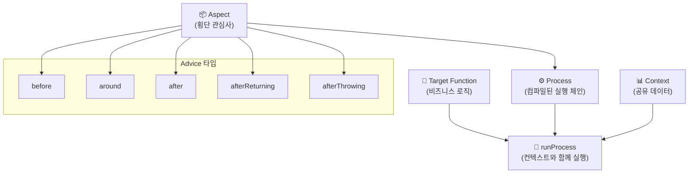
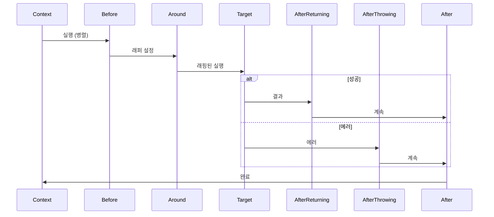
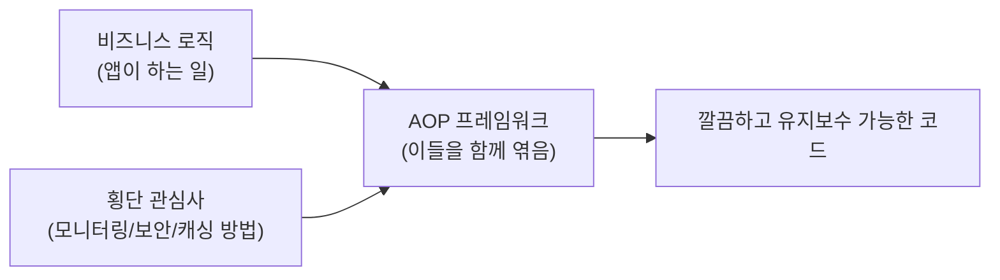
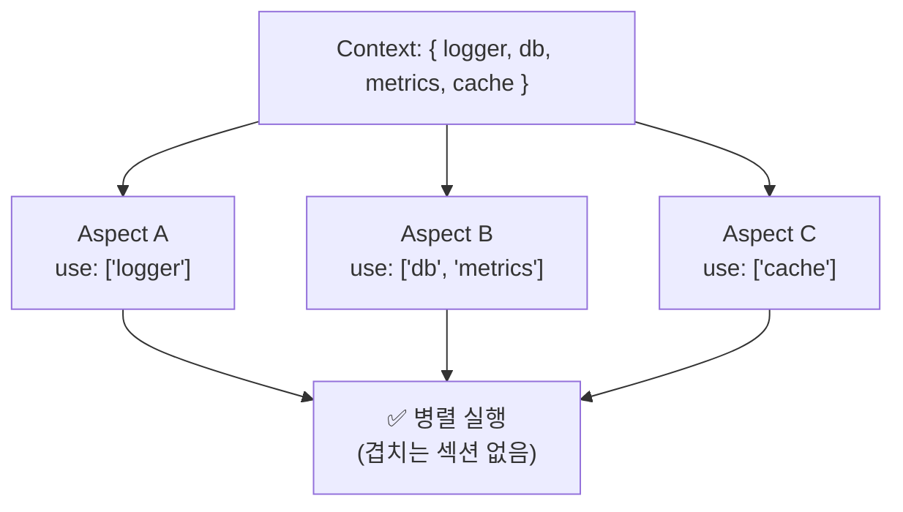
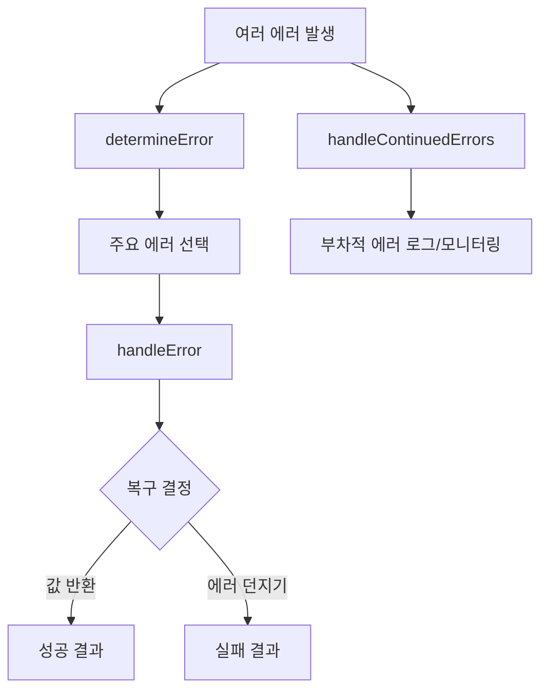
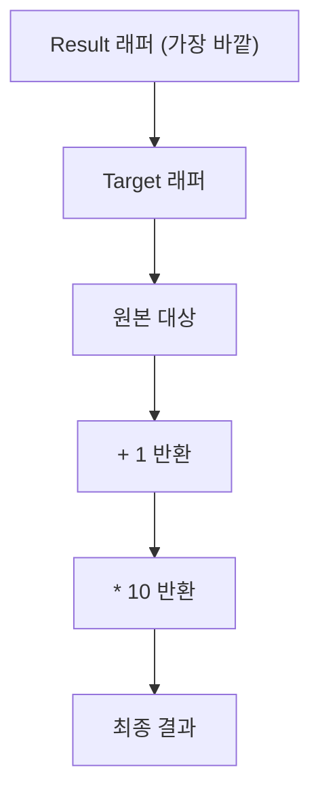

# Promise-AOP

**최신 버전: v4.1.0**

깔끔하고 유지보수하기 쉬운 비동기 코드를 위한 TypeScript-first AOP(Aspect-Oriented Programming) 프레임워크입니다. 로깅, 캐싱, 에러 처리 등의 횡단 관심사를 구조화된 방식으로 관리하며, 타입 안전성과 명시적 컨텍스트 관리에 중점을 둡니다.

[English Documentation](../README.md)

## 🏗️ 아키텍처 개요

Promise-AOP는 **Aspect**가 횡단 관심사를 정의하고, **Process**가 이를 실행 체인으로 컴파일하며, **Context**가 스레드 안전한 데이터 접근을 제공하는 명확한 실행 모델을 따릅니다.



### 실행 흐름



---

## 📦 설치

```bash
# npm
npm install @h1y/promise-aop

# yarn
yarn add @h1y/promise-aop

# pnpm
pnpm add @h1y/promise-aop
```

**요구사항**: Node.js 16+ (`AsyncLocalStorage` 사용)

---

## 🚀 빠른 시작

이 예제는 비즈니스 로직 함수에 적용된 간단한 로깅 aspect를 보여줍니다.

```typescript
import { createAspect, createProcess, runProcess } from "@h1y/promise-aop";

// 애플리케이션을 위한 공유 컨텍스트 정의
type AppContext = { logger: Console };

// 1. 횡단 관심사(로깅)를 위한 Aspect 생성
const LoggingAspect = createAspect<string, AppContext>((createAdvice) => ({
  name: "logging",
  before: createAdvice({
    use: ["logger"], // 필요한 컨텍스트 부분 선언
    advice: async ({ logger }) => logger.info("🚀 작업 시작..."),
  }),
  after: createAdvice({
    use: ["logger"],
    advice: async ({ logger }) => logger.info("✅ 작업 완료!"),
  }),
}));

// 2. aspect들을 조합하는 Process 생성
const process = createProcess<string, AppContext>({ aspects: [LoggingAspect] });

// 3. process와 함께 대상 함수 실행
const result = await runProcess({
  process,
  context: () => ({ logger: console }),
  target: async () => {
    // 실제 비즈니스 로직
    await new Promise((resolve) => setTimeout(resolve, 100));
    return "안녕, AOP 세계!";
  },
});

console.log(result); // "안녕, AOP 세계!"

// 콘솔 출력:
// 🚀 작업 시작...
// ✅ 작업 완료!
```

**무엇이 일어났나요?**

1. **Aspect 정의**: `before`와 `after` advice를 가진 재사용 가능한 로깅 관심사를 만들었습니다
2. **Process 컴파일**: aspect들을 실행 가능한 process로 조합했습니다
3. **컨텍스트 제공**: 모든 aspect에 공유 서비스(logger)를 제공했습니다
4. **자동 위빙**: 프레임워크가 자동으로 대상 함수 주변에서 advice를 실행했습니다

---

## 🧐 AOP 개념 이해하기

Promise-AOP에 들어가기 전에 핵심 개념들을 이해해보겠습니다:

### Aspect-Oriented Programming이란?

**Aspect-Oriented Programming (AOP)**는 **횡단 관심사**(로깅, 보안, 캐싱 등)를 주요 비즈니스 로직에서 분리하는 프로그래밍 패러다임입니다.



### 주요 용어

| 용어        | 정의                                           | 예시                                |
| ----------- | ---------------------------------------------- | ----------------------------------- |
| **Aspect**  | 횡단 관심사를 캡슐화하는 모듈 단위             | `LoggingAspect`, `CachingAspect`    |
| **Advice**  | 실제로 실행되는 코드 (언제/어떻게/어디서)      | `before`, `after`, `around`         |
| **Target**  | 원본 비즈니스 함수                             | `getUserById()`, `processPayment()` |
| **Context** | 모든 aspect에서 사용 가능한 공유 데이터/서비스 | `{ logger, db, metrics }`           |
| **Process** | aspect들과 target의 컴파일된 실행 체인         | `createProcess()`의 결과            |

### 컨텍스트 & 섹션 기반 접근

Promise-AOP는 스레드 안전한 접근을 위해 **섹션 기반 컨텍스트 시스템**을 사용합니다:



## ✨ 왜 Promise-AOP인가?

Promise-AOP는 횡단 관심사를 핵심 비즈니스 로직에서 분리하여 더 깔끔하고 유지보수하기 쉬우며 테스트 가능한 코드를 만들 수 있도록 도와줍니다.

**이전: 관심사 분산**

```typescript
// 비즈니스 로직이 로깅, 메트릭, 에러 처리로 어수선함
async function getUser(id: string) {
  logger.info(`사용자 ${id} 조회 중...`);
  const startTime = Date.now();
  try {
    const user = await db.fetchUser(id);
    metrics.record("user.fetch.success", Date.now() - startTime);
    return user;
  } catch (e) {
    logger.error(`사용자 ${id} 조회 실패`, e);
    metrics.record("user.fetch.failure", Date.now() - startTime);
    throw e;
  }
}
```

**이후: 깔끔한 분리**

```typescript
// 순수한 비즈니스 로직, 읽기 쉽고 테스트하기 쉬움
const fetchUser = async (id: string) => db.fetchUser(id);

// 관심사를 선언적으로 적용
const processedGetUser = (id: string) =>
  runProcess({
    process: createProcess({ aspects: [LoggingAspect, MetricsAspect] }),
    context: () => ({ logger, metrics, db }),
    target: async () => fetchUser(id),
  });
```

**주요 이점:**

- **관심사 분리**: 비즈니스 로직을 인프라 코드에서 격리
- **타입 안전성**: 지능적인 컨텍스트 추론과 완전한 TypeScript 지원
- **섹션 기반 잠금**: 공유 컨텍스트에 대한 안전한 동시 접근
- **보일러플레이트 감소**: 관심사를 한 번 정의하고 어디든 적용
- **중앙화된 제어**: 애플리케이션 전체 정책을 한 곳에서 관리
- **향상된 테스트 가능성**: 관련 없는 서비스를 모킹하지 않고 핵심 로직 테스트

---

## 📚 API 레퍼런스

### 핵심 함수

#### `createAspect<Result, Context>(factory)`

횡단 관심사를 위한 모듈 단위인 aspect를 생성합니다.

**타입 매개변수:**

- `Result`: 대상 함수의 예상 반환 타입
- `Context`: 모든 advice에서 사용 가능한 공유 객체 (키가 섹션 이름인 딕셔너리 형태)

**매개변수:**

- `factory`: `(createAdvice: AdviceGeneratorHelper<Result, Context>) => Aspect<Result, Context>`

**반환값:** `Aspect<Result, Context>`

```typescript
type Aspect<Result, Context> = {
  readonly name: string;
  readonly before?: AdviceMetadata<Result, Context, "before">;
  readonly around?: AdviceMetadata<Result, Context, "around">;
  readonly afterReturning?: AdviceMetadata<Result, Context, "afterReturning">;
  readonly afterThrowing?: AdviceMetadata<Result, Context, "afterThrowing">;
  readonly after?: AdviceMetadata<Result, Context, "after">;
};
```

#### `createAdvice(metadata)` 헬퍼

`createAdvice` 헬퍼 함수는 단일 advice의 동작을 정의합니다.

```typescript
type AdviceMetadata<Result, Context, AdviceType, Sections> = {
  readonly use?: Sections; // 컨텍스트 섹션 이름 배열
  readonly dependsOn?: readonly string[]; // aspect 이름 배열
  readonly advice: AdviceFunctionWithContext<Result, Context, AdviceType>;
};
```

**속성:**

| 속성         | 타입                | 설명                                                                        |
| ------------ | ------------------- | --------------------------------------------------------------------------- |
| `use?`       | `(keyof Context)[]` | 이 advice가 필요로 하는 컨텍스트 섹션. 타입 검사와 섹션 기반 잠금을 활성화. |
| `dependsOn?` | `string[]`          | 이 advice가 (같은 단계에서) 뒤에 실행되어야 하는 aspect 이름들.             |
| `advice`     | `AdviceFunction`    | 실제 advice 로직. 시그니처는 advice 타입에 따라 다름.                       |

#### Advice 함수 시그니처

| Advice 타입      | 시그니처                                                                        | 목적                 |
| ---------------- | ------------------------------------------------------------------------------- | -------------------- |
| `before`         | `(context: Restricted<Context, Sections>) => Promise<void>`                     | 설정, 검증, 준비     |
| `around`         | `(context: Restricted<Context, Sections>, hooks: AroundHooks) => Promise<void>` | 래핑, 변환, 캐싱     |
| `afterReturning` | `(context: Restricted<Context, Sections>, result: Result) => Promise<void>`     | 성공 처리, 정리      |
| `afterThrowing`  | `(context: Restricted<Context, Sections>, error: unknown) => Promise<void>`     | 에러 처리, 로깅      |
| `after`          | `(context: Restricted<Context, Sections>) => Promise<void>`                     | 항상 실행, 최종 정리 |

**Around Advice 훅:**

```typescript
type AroundHooks<Result> = {
  attachToTarget: (wrapper: TargetWrapper<Result>) => void;
  attachToResult: (wrapper: TargetWrapper<Result>) => void;
};

type TargetWrapper<Result> = (target: Target<Result>) => Target<Result>;
type Target<Result> = () => Promise<Result>;
```

#### `createProcess<Result, Context>(config)`

aspect 집합을 실행 가능한 process로 컴파일합니다.

**타입 매개변수:**

- `Result`: 대상 함수들의 예상 반환 타입
- `Context`: 공유 컨텍스트 타입

**매개변수:**

```typescript
type CreateProcessConfig<Result, Context> = {
  readonly aspects: readonly Aspect<Result, Context>[];
  readonly buildOptions?: BuildOptions;
  readonly processOptions?: ProcessOptions<Result, Context>;
};
```

**반환값:** `Process<Result, Context>`

```typescript
type Process<Result, Context> = (
  context: ContextAccessor<Context>,
  exit: ExecutionOuterContext,
  target: Target<Result>,
) => Promise<Result>;
```

#### `runProcess<Result, Context>(props)`

대상 함수와 컨텍스트로 process를 실행합니다.

**매개변수:**

```typescript
type RunProcessProps<Result, Context> = {
  readonly process: Process<Result, Context>;
  readonly target: Target<Result>; // () => Promise<Result>
  readonly context: ContextGenerator<Context> | AsyncContext<Context>;
};

type ContextGenerator<Context> = () => Context;
```

**반환값:** `Promise<Result>`

**컨텍스트 타입:**

- `ContextGenerator<Context>`: 컨텍스트를 반환하는 간단한 함수
- `AsyncContext<Context>`: 비동기 경계를 넘어 자동 전파

**예시:**

```typescript
// 컨텍스트 생성기 사용
const result = await runProcess({
  process,
  target: async () => fetchUserData(id),
  context: () => ({ logger: console, db }),
});

// AsyncContext 사용하여 전파
const asyncCtx = AsyncContext.create(() => ({ logger, db }));
const result = await runProcess({
  process,
  target: async () => fetchUserData(id),
  context: asyncCtx,
});
```

### 설정 옵션

#### `BuildOptions`

각 advice 타입의 실행 전략과 에러 처리를 제어합니다.

```typescript
type BuildOptions = {
  readonly advice?: {
    readonly [AdviceType in Advice]?: {
      readonly execution?: ExecutionStrategy;
      readonly error?: {
        readonly aggregation?: AggregationUnit;
        readonly runtime?: {
          readonly afterThrow?: ErrorAfter;
        };
      };
    };
  };
};

type ExecutionStrategy = "parallel" | "sequential";
type AggregationUnit = "unit" | "all";
type ErrorAfter = "halt" | "continue";
```

**기본 설정:**

| Advice 타입      | 실행         | 집계   | 에러 후    | 비고                         |
| ---------------- | ------------ | ------ | ---------- | ---------------------------- |
| `before`         | `parallel`   | `unit` | `halt`     | 첫 번째 에러에서 빠르게 실패 |
| `around`         | `sequential` | `unit` | `halt`     | 순차적으로 래핑              |
| `afterReturning` | `parallel`   | `all`  | `continue` | 모든 에러 수집               |
| `afterThrowing`  | `parallel`   | `all`  | `continue` | 모든 에러 수집               |
| `after`          | `parallel`   | `all`  | `continue` | 항상 실행                    |

**에러 설정 옵션:**

- `aggregation: "unit"`: 첫 번째 에러에서 중단
- `aggregation: "all"`: 모든 에러 수집
- `afterThrow: "halt"`: 에러 시 실행 중단
- `afterThrow: "continue"`: 에러에도 불구하고 계속

**섹션 잠금:** 병렬 advice가 같은 컨텍스트 섹션을 사용하면 Promise-AOP는 런타임 에러를 던집니다. 해결 방법:

1. 실행을 `sequential`로 만들기
2. `dependsOn` 관계 설정
3. 다른 컨텍스트 섹션 사용

#### `ProcessOptions`

중앙화된 에러 처리 및 복구 설정입니다.

```typescript
type ProcessOptions<Result, Context> = {
  readonly determineError?: (props: {
    context: ContextAccessor<Context>;
    exit: ExecutionOuterContext;
    errors: unknown[];
    info: ErrorInfo;
  }) => Promise<unknown>;

  readonly handleError?: (props: {
    currentTarget: Target<Result>;
    context: ContextAccessor<Context>;
    exit: ExecutionOuterContext;
    error: unknown;
  }) => Promise<Result>;

  readonly handleContinuedErrors?: (props: {
    context: ContextAccessor<Context>;
    exit: ExecutionOuterContext;
    errors: readonly (readonly [unknown[], ErrorInfo])[];
  }) => Promise<void>;
};
```

**에러 처리 흐름:**



**핸들러 설명:**

| 핸들러                  | 목적                                | 반환 동작                           |
| ----------------------- | ----------------------------------- | ----------------------------------- |
| `determineError`        | 여러 실패에서 주요 에러 선택        | 가장 중요한 에러 반환               |
| `handleError`           | 핵심 복구 로직, 현재 타겟 정보 활용 | `Result` 반환하여 복구, 던져서 실패 |
| `handleContinuedErrors` | 부차적 에러 처리                    | 로깅/모니터링 전용                  |

**기본 동작:**

- `determineError`: 첫 번째 에러 반환
- `handleError`: 에러 재던지기 (복구 없음), `currentTarget`을 통해 에러가 발생한 타겟 함수 정보 제공
- `handleContinuedErrors`: 아무것도 하지 않음

**currentTarget 활용:**

- 에러가 발생한 대상 함수의 참조를 제공하여 더 정확한 디버깅과 로깅 가능
- 타겟별로 다른 복구 전략을 적용할 수 있음
- 에러 컨텍스트에 함수 이름이나 메타데이터 포함 가능

<details>
<summary><strong>고급 에러 처리 예시</strong></summary>

```typescript
class DatabaseError extends Error {
  name = "DatabaseError";
}
class LoggingError extends Error {
  name = "LoggingError";
}

const process = createProcess<string, AppContext>({
  aspects: [DatabaseAspect, LoggingAspect],
  processOptions: {
    // 로깅 에러보다 데이터베이스 에러 우선순위
    determineError: async ({ errors }) => {
      return errors.find((e) => e instanceof DatabaseError) ?? errors[0];
    },

    // 복구 전략 구현
    handleError: async ({ currentTarget, context, error }) => {
      const { logger, cache } = context();

      if (error instanceof DatabaseError) {
        logger.error(
          `데이터베이스 실패 (타겟: ${currentTarget.name}), 캐시 사용`,
          error,
        );
        return cache.get("fallback-value");
      }

      // 타겟 함수 정보를 포함한 에러 로깅
      logger.error(
        `처리할 수 없는 에러 발생 (타겟: ${currentTarget.name})`,
        error,
      );
      throw error; // 복구할 수 없는 에러 재던지기
    },

    // 모니터링을 위한 부차적 에러 로그
    handleContinuedErrors: async ({ context, errors }) => {
      const { metrics } = context();
      errors.forEach(([errorList]) => {
        errorList.forEach((error) => {
          metrics.incrementCounter("secondary_errors", {
            type: error.constructor.name,
          });
        });
      });
    },
  },
});
```

</details>

### 타입 레퍼런스

#### 핵심 타입

```typescript
// 주요 내보내기
export { createAspect, createProcess, runProcess, AsyncContext };

// 에러 타입
export { Rejection, HaltRejection, ContinuousRejection };

// 설정 타입
export type { BuildOptions, ProcessOptions };
export type { Aspect, Process, Target };
export type { Advice, AdviceMetadata };
```

#### 컨텍스트 타입

```typescript
type ContextGenerator<Context> = () => Context;
type ContextAccessor<Context> = () => Context;
type SectionsUsed<Context> = readonly (keyof Context)[];
type Restricted<
  Context,
  Sections extends SectionsUsed<Context>,
> = Context extends object
  ? { readonly [key in Sections[number]]: Context[key] }
  : Context;
```

#### 유틸리티 타입

```typescript
type ExecutionOuterContext = <SharedContext>(
  callback: () => SharedContext,
) => SharedContext;
```

---

## 🔬 고급 주제

<details>
<summary><strong>🎯 Around Advice 컴포지션</strong></summary>

`around` advice는 가장 강력하며, 대상 함수의 실행을 래핑할 수 있습니다. 두 가지 훅을 제공합니다:

- `attachToTarget(wrapper)`: 원본 대상 함수를 래핑합니다. 이 래퍼들은 대상에 가장 가깝게 실행됩니다.
- `attachToResult(wrapper)`: 다른 `around` advice를 포함한 _전체_ 실행 체인을 래핑합니다. 이 래퍼들은 가장 바깥 레이어에서 실행됩니다.

래퍼들은 양파처럼 구성됩니다: 마지막에 붙인 것이 첫 번째로 실행됩니다 (LIFO).

```typescript
const AdvancedAspect = createAspect<number, { log: Console }>(
  (createAdvice) => ({
    name: "advanced",
    around: createAdvice({
      use: ["log"],
      advice: async ({ log }, { attachToTarget, attachToResult }) => {
        // 1. Result 래퍼 (가장 바깥)
        attachToResult((target) => async () => {
          log.info("Result 래퍼: 시작");
          const result = await target(); // 대상 래퍼들 + 원본 대상 실행
          log.info("Result 래퍼: 종료");
          return result * 10;
        });

        // 2. Target 래퍼 (가장 안쪽)
        attachToTarget((target) => async () => {
          log.info("Target 래퍼: 시작");
          const result = await target(); // 원본 대상 실행
          log.info("Target 래퍼: 종료");
          return result + 1;
        });
      },
    }),
  }),
);

// 원본 대상이 5를 반환하면:
// 콘솔 출력:
// > Result 래퍼: 시작
// > Target 래퍼: 시작
// > Target 래퍼: 종료
// > Result 래퍼: 종료
// 최종 결과: (5 + 1) * 10 = 60
```

**컴포지션 시각화:**



</details>

<details>
<summary><strong>⚡ 성능 및 최적화</strong></summary>

### 컨텍스트 최적화

- **최소 컨텍스트**: `use`를 통해 필요한 섹션만 요청하여 오버헤드 감소 및 섹션 충돌 방지
- **섹션 격리**: 더 나은 병렬화를 위해 세분화된 섹션으로 컨텍스트 설계

### 실행 전략

- **기본적으로 병렬**: 대부분의 advice 타입은 더 나은 성능을 위해 병렬로 실행
- **전략적 순차**: 순서가 중요할 때만 (예: 데이터베이스 트랜잭션) `execution: "sequential"` 사용

### 프로세스 재사용

- **프로세스 메모이제이션**: `createProcess`는 계산 집약적 - 한 번 생성하고 어디서나 재사용
- **상태 없는 설계**: 프로세스는 상태가 없고 스레드 안전 - 요청 간 안전하게 공유

```typescript
// ✅ 좋음: 한 번 생성하고 재사용
const commonProcess = createProcess({
  aspects: [LoggingAspect, MetricsAspect],
});

const processUserRequest = (data) =>
  runProcess({
    process: commonProcess, // 재사용
    target: async () => processUser(data),
    context: () => ({ logger, metrics, db }),
  });

// ❌ 나쁨: 매번 프로세스 생성
const processUserRequest = (data) =>
  runProcess({
    process: createProcess({ aspects: [LoggingAspect, MetricsAspect] }), // 재생성
    target: async () => processUser(data),
    context: () => ({ logger, metrics, db }),
  });
```

</details>

<details>
<summary><strong>🔧 실제 패턴들</strong></summary>

### 계층형 아키텍처 패턴

```typescript
// 인프라 레이어
const InfrastructureAspects = [LoggingAspect, MetricsAspect, TracingAspect];

// 비즈니스 레이어
const BusinessAspects = [ValidationAspect, AuthorizationAspect, CachingAspect];

// 특화된 프로세스들 생성
const infraProcess = createProcess({ aspects: InfrastructureAspects });
const businessProcess = createProcess({ aspects: BusinessAspects });
const fullProcess = createProcess({
  aspects: [...InfrastructureAspects, ...BusinessAspects],
});
```

### 조건부 Advice 패턴

```typescript
const ConditionalAspect = createAspect<User, AppContext>((createAdvice) => ({
  name: "conditional",
  before: createAdvice({
    use: ["config", "logger"],
    advice: async ({ config, logger }) => {
      if (config.enableDetailedLogging) {
        logger.info("상세 로깅 활성화됨");
      }
    },
  }),
}));
```

### 에러 복구 패턴

```typescript
const RetryAspect = createAspect<Data, AppContext>((createAdvice) => ({
  name: "retry",
  around: createAdvice({
    use: ["logger"],
    advice: async ({ logger }, { attachToTarget }) => {
      attachToTarget((target) => async () => {
        let attempts = 0;
        const maxAttempts = 3;

        while (attempts < maxAttempts) {
          try {
            return await target();
          } catch (error) {
            attempts++;
            if (attempts >= maxAttempts) throw error;

            logger.warn(`시도 ${attempts} 실패, 재시도 중...`);
            await new Promise((resolve) =>
              setTimeout(resolve, 1000 * attempts),
            );
          }
        }
      });
    },
  }),
}));
```

</details>

---

## 🔧 개발

```bash
# 의존성 설치
yarn install

# 테스트 실행
yarn test

# 라이브러리 빌드
yarn build
```

---

## 📝 라이선스

MIT © [h1ylabs](https://github.com/h1ylabs)
