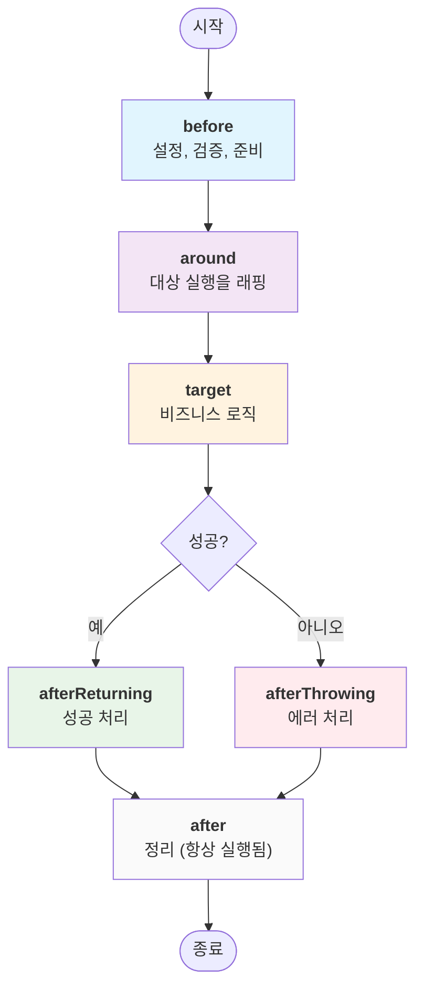

# Promise-AOP

**최신 버전: v3.0.0**

깔끔하고 유지보수하기 쉬운 비동기 코드를 위한 TypeScript-first AOP(Aspect-Oriented Programming) 프레임워크입니다. 횡단 관심사를 한 번 작성하고 어디든 적용하세요.

- ✨ **타입 안전**: 지능적인 컨텍스트 추론과 완전한 TypeScript 지원
- 🔒 **섹션 기반 잠금**: 공유 컨텍스트에 대한 안전한 동시 접근
- 🎯 **유연한 조합**: before, around, after 어드바이스와 의존성 순서 지정
- 🛡️ **견고한 에러 처리**: 구조화된 에러 분류와 복구 전략
- 📦 **의존성 없음**: 경량화된 완전한 ESM/CJS 지원

[English README](../README.md)

---

## 🚀 빠른 시작

간단한 로깅 예제로 5분 안에 시작해보세요:

```typescript
import { createAspect, createProcess, runProcess } from "@h1y/promise-aop";

// 1단계: 로깅을 처리하는 aspect 생성
const LoggingAspect = createAspect<string, { logger: Console }>(
  (createAdvice) => ({
    name: "logging",
    before: createAdvice({
      use: ["logger"],
      advice: async ({ logger }) => logger.info("🚀 작업 시작..."),
    }),
    after: createAdvice({
      use: ["logger"],
      advice: async ({ logger }) => logger.info("✅ 작업 완료!"),
    }),
  }),
);

// 2단계: aspect들을 결합하는 process 생성
const process = createProcess<string, { logger: Console }>({
  aspects: [LoggingAspect],
});

// 3단계: process와 함께 대상 함수 실행
const result = await runProcess({
  process,
  context: () => ({ logger: console }),
  target: async () => {
    // 실제 비즈니스 로직은 여기에
    await new Promise((resolve) => setTimeout(resolve, 100));
    return "안녕, AOP 세계!";
  },
});

console.log(result); // "안녕, AOP 세계!"

// 출력 결과:
// 🚀 작업 시작...
// ✅ 작업 완료!
```

**무슨 일이 일어났을까요?**

1. 모든 함수의 전후에 실행되는 **로깅 aspect**를 만들었습니다
2. 모든 대상 함수에 적용할 수 있는 **process로 조합**했습니다
3. 자동 로깅이 적용된 **비즈니스 로직을 실행**했습니다

---

## 📦 설치

```bash
# npm
npm install @h1y/promise-aop

# yarn
yarn add @h1y/promise-aop

# pnpm
pnpm add @h1y/promise-aop
```

**요구사항**: Node.js 16+ (AsyncLocalStorage 사용)

---

## 💡 왜 Promise-AOP인가?

### 문제점

AOP 없이는 로깅, 인증, 에러 처리 같은 횡단 관심사가 코드베이스 전반에 흩어져 유지보수가 어려워집니다:

```typescript
// ❌ 관심사 분산 - 유지보수가 어려움
async function getUserData(userId: string) {
  console.log("🚀 getUserData 시작..."); // 로깅

  if (!isAuthenticated()) {
    // 인증
    throw new Error("인증되지 않음");
  }

  try {
    const start = Date.now(); // 메트릭
    const data = await database.query(userId);
    metrics.record("getUserData", Date.now() - start);

    console.log("✅ getUserData 완료!"); // 더 많은 로깅
    return data;
  } catch (error) {
    logger.error("getUserData 실패:", error); // 에러 처리
    throw error;
  }
}
```

### 해결책

Promise-AOP를 사용하면 관심사를 깔끔하게 분리할 수 있습니다:

```typescript
// ✅ 관심사 분리 - 비즈니스 로직이 순수함
const getUserData = async (userId: string) => {
  return database.query(userId); // 순수한 비즈니스 로직
};

// 로깅, 인증, 메트릭을 자동으로 적용
const result = await runProcess({
  process: createProcess({
    aspects: [LoggingAspect, AuthAspect, MetricsAspect],
  }),
  context: () => ({ logger: console, auth, metrics, database }),
  target: getUserData,
});
```

**Promise-AOP를 사용해야 하는 경우:**

- 🔐 **인증/권한 부여**를 여러 엔드포인트에 적용할 때
- 📊 **로깅 및 메트릭** 수집
- ⚡ **캐싱** 비용이 많이 드는 작업
- 🔄 **재시도 로직**을 불안정한 서비스에 적용할 때
- 🛡️ **에러 처리 및 복구**
- ⏱️ **성능 모니터링**

---

## 🧠 핵심 개념

### 어드바이스 타입

Promise-AOP는 함수 라이프사이클의 서로 다른 지점에서 실행되는 다섯 가지 어드바이스 타입을 지원합니다:

```typescript
const MyAspect = createAspect<Result, Context>((createAdvice) => ({
  name: "example",

  // 1. Before - 설정 및 검증
  before: createAdvice({
    use: ["auth"],
    advice: async ({ auth }) => {
      if (!auth.isValid()) throw new Error("인증되지 않음");
    },
  }),

  // 2. Around - 전체 실행을 래핑
  around: createAdvice({
    use: ["cache"],
    advice: async ({ cache }, { attachToTarget }) => {
      attachToTarget((target) => async () => {
        const cached = await cache.get("key");
        if (cached) return cached;

        const result = await target();
        await cache.set("key", result);
        return result;
      });
    },
  }),

  // 3. AfterReturning - 성공 처리
  afterReturning: createAdvice({
    use: ["logger"],
    advice: async ({ logger }, result) => {
      logger.info("성공:", result);
    },
  }),

  // 4. AfterThrowing - 에러 처리
  afterThrowing: createAdvice({
    use: ["logger"],
    advice: async ({ logger }, error) => {
      logger.error("실패:", error);
    },
  }),

  // 5. After - 정리 (항상 실행됨)
  after: createAdvice({
    use: ["metrics"],
    advice: async ({ metrics }) => {
      metrics.increment("operation_completed");
    },
  }),
}));
```

### 실행 플로우



### 컨텍스트 & 섹션 기반 접근

컨텍스트는 공유 상태이며, 안전한 동시 접근을 위해 명명된 섹션으로 나뉩니다:

```typescript
type MyContext = {
  database: { query: (sql: string) => Promise<any> };
  logger: Console;
  cache: { get: (k: string) => any; set: (k: string, v: any) => void };
  auth: { userId: string; isAdmin: boolean };
};

const DatabaseAspect = createAspect<any, MyContext>((createAdvice) => ({
  name: "database",
  before: createAdvice({
    use: ["database", "auth"], // 필요한 섹션을 선언
    advice: async ({ database, auth }) => {
      // 여기서는 database와 auth만 사용 가능
      // 이를 통해 우발적 결합을 방지하고 안전한 병렬 처리 가능
    },
  }),
}));
```

### 의존성 기반 순서 지정

여러 aspect가 동일한 어드바이스 단계에 영향을 줄 때 실행 순서를 제어합니다:

```typescript
const AuthAspect = createAspect<any, Context>((createAdvice) => ({
  name: "auth",
  before: createAdvice({
    use: ["auth"],
    advice: async ({ auth }) => {
      // 사용자 권한 검증
    },
  }),
}));

const LoggingAspect = createAspect<any, Context>((createAdvice) => ({
  name: "logging",
  before: createAdvice({
    use: ["logger"],
    dependsOn: ["auth"], // auth aspect 이후에 실행
    advice: async ({ logger }) => {
      logger.info("사용자가 인증되었습니다. 작업을 시작합니다");
    },
  }),
}));
```

---

## 📚 일반적인 패턴

### 인증 & 권한 부여

```typescript
const AuthAspect = createAspect<
  any,
  {
    auth: { token: string; validate: (token: string) => Promise<boolean> };
    logger: Console;
  }
>((createAdvice) => ({
  name: "auth",
  before: createAdvice({
    use: ["auth", "logger"],
    advice: async ({ auth, logger }) => {
      const isValid = await auth.validate(auth.token);
      if (!isValid) {
        logger.warn("인증 실패");
        throw new Error("인증되지 않은 접근");
      }
      logger.info("사용자가 성공적으로 인증되었습니다");
    },
  }),
}));
```

### Around 어드바이스를 사용한 캐싱

```typescript
const CacheAspect = createAspect<
  any,
  {
    cache: {
      get: (key: string) => Promise<any>;
      set: (key: string, value: any) => Promise<void>;
    };
  }
>((createAdvice) => ({
  name: "cache",
  around: createAdvice({
    use: ["cache"],
    advice: async ({ cache }, { attachToTarget }) => {
      attachToTarget((target) => async () => {
        const cacheKey = "operation_result";

        // 먼저 캐시 확인
        const cached = await cache.get(cacheKey);
        if (cached) return cached;

        // 대상 실행 후 결과 캐시
        const result = await target();
        await cache.set(cacheKey, result);
        return result;
      });
    },
  }),
}));
```

### 에러 처리 & 복구

```typescript
const ErrorHandlingAspect = createAspect<
  string,
  {
    logger: Console;
    fallback: { getValue: () => string };
  }
>((createAdvice) => ({
  name: "error-handling",
  afterThrowing: createAdvice({
    use: ["logger"],
    advice: async ({ logger }, error) => {
      logger.error("작업 실패:", error);
      // 에러 세부 정보 로깅, 모니터링 서비스 전송 등
    },
  }),
}));

// 프로세스 레벨에서 에러 복구 구성
const process = createProcess({
  aspects: [ErrorHandlingAspect],
  processOptions: {
    resolveHaltRejection: async (context, exit, error) => {
      // 대체 대상 함수 반환
      return async () => {
        const fallback = context().fallback;
        return fallback.getValue();
      };
    },
  },
});
```

### 메트릭 & 성능 모니터링

```typescript
const MetricsAspect = createAspect<
  any,
  {
    metrics: {
      startTimer: (name: string) => void;
      endTimer: (name: string) => void;
      increment: (name: string) => void;
    };
  }
>((createAdvice) => ({
  name: "metrics",
  before: createAdvice({
    use: ["metrics"],
    advice: async ({ metrics }) => {
      metrics.startTimer("operation_duration");
    },
  }),
  afterReturning: createAdvice({
    use: ["metrics"],
    advice: async ({ metrics }) => {
      metrics.endTimer("operation_duration");
      metrics.increment("operation_success");
    },
  }),
  afterThrowing: createAdvice({
    use: ["metrics"],
    advice: async ({ metrics }) => {
      metrics.endTimer("operation_duration");
      metrics.increment("operation_failure");
    },
  }),
}));
```

---

## 🔧 고급 예제

### 복잡한 Around 어드바이스: 이중 부착 지점

around 어드바이스는 정교한 래퍼 조합을 위한 두 가지 부착 지점을 제공합니다:

```typescript
const AdvancedCacheAspect = createAspect<
  number,
  {
    cache: {
      get: (k: string) => Promise<number | null>;
      set: (k: string, v: number) => Promise<void>;
    };
    logger: Console;
  }
>((createAdvice) => ({
  name: "advanced-cache",
  around: createAdvice({
    use: ["cache", "logger"],
    advice: async ({ cache, logger }, { attachToTarget, attachToResult }) => {
      // attachToTarget: 원본 대상 함수를 래핑
      // 실제 대상에 가장 가깝게 실행됨
      attachToTarget((target) => async () => {
        logger.info("🎯 타겟 래퍼: 캐시 확인 중...");
        const cached = await cache.get("data");
        if (cached) {
          logger.info("💾 캐시 히트!");
          return cached;
        }

        logger.info("🔍 캐시 미스, 타겟 실행 중...");
        const result = await target();
        await cache.set("data", result);
        return result;
      });

      // attachToResult: 전체 실행 체인을 래핑
      // 가장 바깥쪽에서 실행되며, 모든 타겟 래퍼 이후에 실행됨
      attachToResult((target) => async () => {
        logger.info("🌟 결과 래퍼: 실행 시작...");
        const start = Date.now();
        const result = await target();
        const duration = Date.now() - start;
        logger.info(`⚡ 결과 래퍼: ${duration}ms에 완료`);
        return result * 2; // 최종 결과 변환
      });
    },
  }),
}));

// 타겟 값 5에 대한 실행 플로우:
// 🌟 결과 래퍼: 실행 시작...
// 🎯 타겟 래퍼: 캐시 확인 중...
// 🔍 캐시 미스, 타겟 실행 중...
// [원본 타겟 실행: 5]
// ⚡ 결과 래퍼: 123ms에 완료
// 최종 결과: 10 (5 * 2 from result wrapper)
```

### AsyncContext 통합

Promise-AOP는 더 나은 컨텍스트 관리를 위해 완벽한 AsyncContext 통합을 제공합니다:

```typescript
import { AsyncContext, createProcess, runProcess } from "@h1y/promise-aop";

// 공유 데이터로 AsyncContext 생성
const asyncContext = AsyncContext.create(() => ({
  userId: "12345",
  logger: console,
  database: myDatabase,
  requestId: crypto.randomUUID(),
}));

// runProcess와 함께 사용 (자동 컨텍스트 전파)
const result = await runProcess({
  process: myProcess,
  context: asyncContext, // AsyncContext를 직접 전달
  target: async () => "Hello World",
});

// 또는 수동 제어를 위해 AsyncContext.execute 사용
const manualResult = await AsyncContext.execute(
  asyncContext,
  (getContext, exit) => myProcess(getContext, exit, async () => "수동 실행"),
);
```

### 여러 Aspect 조합

```typescript
const AuthAspect = createAspect<ApiResponse, AppContext>((createAdvice) => ({
  name: "auth",
  before: createAdvice({
    use: ["auth"],
    advice: async ({ auth }) => {
      if (!auth.isAuthenticated()) throw new Error("로그인하세요");
    },
  }),
}));

const CacheAspect = createAspect<ApiResponse, AppContext>((createAdvice) => ({
  name: "cache",
  around: createAdvice({
    use: ["cache"],
    advice: async ({ cache }, { attachToTarget }) => {
      attachToTarget((target) => async () => {
        const key = "api_response";
        const cached = await cache.get(key);
        if (cached) return cached;

        const result = await target();
        await cache.set(key, result, { ttl: 300 });
        return result;
      });
    },
  }),
}));

const LoggingAspect = createAspect<ApiResponse, AppContext>((createAdvice) => ({
  name: "logging",
  before: createAdvice({
    use: ["logger"],
    dependsOn: ["auth"], // 성공적인 인증 이후에만 로그
    advice: async ({ logger }) => logger.info("🚀 API 요청 시작"),
  }),
  after: createAdvice({
    use: ["logger"],
    advice: async ({ logger }) => logger.info("✅ API 요청 완료"),
  }),
}));

// 모든 aspect를 함께 조합
const apiProcess = createProcess<ApiResponse, AppContext>({
  aspects: [AuthAspect, CacheAspect, LoggingAspect],
});
```

---

## 🛡️ 에러 처리 전략

Promise-AOP는 세 가지 종류의 rejection으로 구조화된 에러 처리 접근 방식을 제공합니다:

### Rejection 유형

```typescript
import {
  Rejection,
  HaltRejection,
  ContinuousRejection,
} from "@h1y/promise-aop";

// 모든 AOP 에러의 기본 클래스
const rejection = new Rejection({
  error: new Error("문제가 발생했습니다"),
  extraInfo: {
    type: "advice", // "target" | "advice" | "unknown"
    advice: someAdvice, // type이 "advice"일 때 제공됨
  },
});

// 전체 체인을 중단하는 중요한 에러
const haltRejection = new HaltRejection({
  error: new Error("인증 실패"),
  extraInfo: { type: "advice", advice: authAdvice },
});

// 수집되지만 실행을 중단하지 않는 비중요한 에러
const continuousRejection = new ContinuousRejection({
  error: new Error("메트릭 수집 실패"),
  extraInfo: { type: "advice", advice: metricsAdvice },
});
```

### 에러 해결 전략

애플리케이션이 다양한 유형의 에러를 처리하는 방식을 구성합니다:

```typescript
const robustProcess = createProcess({
  aspects: [AuthAspect, CacheAspect, MetricsAspect],
  processOptions: {
    // 실행을 중단하는 중요한 에러 처리
    resolveHaltRejection: async (context, exit, error) => {
      const { logger, fallback } = context();
      logger.error("중요한 실패:", error.info.error.message);

      // 대체 대상 함수 반환
      return async () => ({
        success: false,
        fallback: true,
        timestamp: Date.now(),
        data: fallback.defaultValue,
      });
    },

    // 수집된 비중요한 에러 처리
    resolveContinuousRejection: async (context, exit, errors) => {
      const { logger, monitoring } = context();

      errors.forEach((error) => {
        logger.warn("비중요한 에러:", error.info.error.message);
        monitoring.recordError(error);
      });
    },
  },
});
```

### 에러 출처 추적

각 rejection은 출처에 대한 상세한 메타데이터를 포함합니다:

- **`type: "target"`**: 비즈니스 로직에서 발생한 에러
- **`type: "advice"`**: 특정 aspect에서 발생한 에러 (advice 참조 포함)
- **`type: "unknown"`**: 예상치 못한 출처에서 발생한 에러

### 고급 에러 처리 패턴

```typescript
const RobustApiAspect = createAspect<ApiResponse, AppContext>((createAdvice) => ({
  name: "robust-api",
  before: createAdvice({
    use: ["auth", "logger", "monitoring"],
    advice: async ({ auth, logger, monitoring }) => {
      try {
        const isValid = await auth.validateToken();
        if (!isValid) {
          // 중요한 에러 - 체인을 중단
          throw new HaltRejection({
            error: new Error("유효하지 않은 인증 토큰"),
            extraInfo: { type: "advice", advice: /* 현재 advice */ }
          });
        }
      } catch (error) {
        if (error instanceof HaltRejection) throw error;

        // 비중요한 모니터링 실패 - 실행 계속
        try {
          monitoring.recordAuthAttempt(false);
        } catch (monitoringError) {
          throw new ContinuousRejection({
            error: monitoringError,
            extraInfo: { type: "advice", advice: /* 현재 advice */ }
          });
        }

        throw error; // 원래 에러 다시 throw
      }
    },
  }),
}));
```

---

## 📚 완전한 API 참조

### 핵심 함수

| 함수                                     | 설명                                   | 반환값                     |
| ---------------------------------------- | -------------------------------------- | -------------------------- |
| `createAspect<Result, Context>(helper)`  | 횡단 관심사를 가진 Aspect 생성         | `Aspect<Result, Context>`  |
| `createProcess<Result, Context>(config)` | Aspect들을 실행 가능한 프로세스로 조합 | `Process<Result, Context>` |
| `runProcess<Result, Context>(props)`     | 컨텍스트와 대상으로 프로세스 실행      | `Promise<Result>`          |

### 내보낸 클래스

| 클래스                  | 설명                                  | 사용처                         |
| ----------------------- | ------------------------------------- | ------------------------------ |
| `Rejection`             | 모든 AOP rejection의 기본 에러 클래스 | 사용자 정의 rejection 처리     |
| `HaltRejection`         | 전체 advice 체인을 중단하는 에러      | 체인 중단이 필요한 중요한 에러 |
| `ContinuousRejection`   | 실행을 계속하며 집계되는 에러         | 수집용 비중요한 에러           |
| `AsyncContext<Context>` | 비동기 컨텍스트 관리 유틸리티         | 비동기 작업 간 컨텍스트 전파   |

### 핵심 타입

```typescript
// 대상 함수 타입
type Target<Result> = () => Promise<Result>;

// around advice용 래퍼 함수
type TargetWrapper<Result> = (target: Target<Result>) => Target<Result>;

// 컴파일된 실행 가능한 프로세스
type Process<Result, SharedContext> = (
  context: ContextAccessor<SharedContext>,
  exit: ExecutionOuterContext,
  target: Target<Result>,
) => Promise<Result>;

// Aspect 정의
type Aspect<Result, Context> = {
  readonly name: string;
  readonly before?: AdviceMetadata<Result, Context, "before">;
  readonly around?: AdviceMetadata<Result, Context, "around">;
  readonly afterReturning?: AdviceMetadata<Result, Context, "afterReturning">;
  readonly afterThrowing?: AdviceMetadata<Result, Context, "afterThrowing">;
  readonly after?: AdviceMetadata<Result, Context, "after">;
};

// 컨텍스트 접근 제어가 있는 advice 메타데이터
type AdviceMetadata<Result, Context, AdviceType, Sections> = {
  readonly use?: Sections; // 선언된 컨텍스트 섹션
  readonly dependsOn?: readonly string[]; // Aspect 의존성
  readonly advice: AdviceFunctionWithContext<Result, Context, AdviceType>;
};
```

### 구성 옵션

```typescript
// advice 타입별 빌드타임 구성
type BuildOptions = {
  advice: {
    [advice in Advice]: {
      execution: "parallel" | "sequential";
      error: {
        aggregation: "unit" | "all";
        runtime: {
          afterThrow: "halt" | "continue";
        };
      };
    };
  };
};

// 프로세스 레벨 에러 해결
type ProcessOptions<Result, SharedContext> = {
  resolveHaltRejection?: (
    context: ContextAccessor<SharedContext>,
    exit: ExecutionOuterContext,
    error: HaltRejection,
  ) => Promise<Target<Result>>;

  resolveContinuousRejection?: (
    context: ContextAccessor<SharedContext>,
    exit: ExecutionOuterContext,
    errors: ContinuousRejection[],
  ) => Promise<void>;
};
```

### 기본 구성

| Advice 타입      | 실행 방식    | 에러 집계 | 에러 런타임 |
| ---------------- | ------------ | --------- | ----------- |
| `before`         | `parallel`   | `unit`    | `halt`      |
| `around`         | `sequential` | `unit`    | `halt`      |
| `afterReturning` | `parallel`   | `all`     | `continue`  |
| `afterThrowing`  | `parallel`   | `all`     | `continue`  |
| `after`          | `parallel`   | `all`     | `continue`  |

---

## 🔬 고급 주제

### 에러 구성 심화 분석

Promise-AOP의 에러 처리 구성을 이해하는 것은 견고한 애플리케이션 구축에 중요합니다. 주요 개념들을 살펴보겠습니다:

#### 에러 집계: `unit` vs `all`

**에러 집계**는 동일한 advice 단계 내에서 여러 에러가 수집되고 처리되는 방식을 결정합니다:

```typescript
// 에러 집계: "unit"
// - 첫 번째 에러가 즉시 실행을 중단
// - 하나의 에러만 캡처되고 처리됨
// - 기본값: before, around

// 에러 집계: "all"
// - 단계 내에서 발생하는 모든 에러 수집
// - 개별 실패에도 불구하고 단계의 모든 advice 실행 시도
// - 모든 에러를 수집하여 함께 처리
// - 기본값: after, afterReturning, afterThrowing
```

**실제 예제:**

```typescript
const LoggingAspects = [
  createAspect<any, { logger: Console }>((createAdvice) => ({
    name: "file-logger",
    after: createAdvice({
      use: ["logger"],
      advice: async ({ logger }) => {
        throw new Error("파일 로깅 실패"); // 에러 1
      },
    }),
  })),
  createAspect<any, { logger: Console }>((createAdvice) => ({
    name: "email-logger",
    after: createAdvice({
      use: ["logger"],
      advice: async ({ logger }) => {
        throw new Error("이메일 로깅 실패"); // 에러 2
      },
    }),
  })),
];

const process = createProcess({
  aspects: LoggingAspects,
  buildOptions: {
    advice: {
      after: {
        execution: "parallel",
        error: {
          aggregation: "all", // ✅ 두 에러 모두 수집됨
          runtime: { afterThrow: "continue" },
        },
      },
    },
  },
});

// 결과: 두 에러 모두 resolveContinuousRejection으로 전달됨
// aggregation이 "unit"이었다면 첫 번째 에러만 캡처됨
```

#### 에러 런타임: `halt` vs `continue`

**에러 런타임** (`afterThrow`)는 advice가 에러를 던질 때 어떤 일이 일어나는지 결정합니다:

```typescript
// 에러 런타임: "halt"
// - 에러가 전체 advice 체인을 즉시 중단
// - resolveHaltRejection 트리거
// - before/around에서 에러 발생 시 대상이 실행되지 않을 수 있음
// - 기본값: before, around

// 에러 런타임: "continue"
// - 에러가 수집되지만 실행을 중단하지 않음
// - 체인이 다음 단계로 계속 진행
// - 수집된 에러들은 resolveContinuousRejection으로 전달
// - 기본값: after, afterReturning, afterThrowing
```

#### 구성 매트릭스

| Advice 단계      | 기본 실행 방식 | 기본 집계 방식 | 기본 런타임 | 이유                                  |
| ---------------- | -------------- | -------------- | ----------- | ------------------------------------- |
| `before`         | `parallel`     | `unit`         | `halt`      | 설정 실패는 실행을 중단해야 함        |
| `around`         | `sequential`   | `unit`         | `halt`      | 래퍼 실패는 중요함                    |
| `afterReturning` | `parallel`     | `all`          | `continue`  | 성공 로깅이 결과를 방해하면 안됨      |
| `afterThrowing`  | `parallel`     | `all`          | `continue`  | 에러 로깅이 원본 에러를 숨기면 안됨   |
| `after`          | `parallel`     | `all`          | `continue`  | 정리 작업 실패가 결과에 영향주면 안됨 |

#### 사용자 정의 에러 동작

특정 요구사항에 맞게 기본값을 재정의할 수 있습니다:

```typescript
const customProcess = createProcess({
  aspects: [MyAspect],
  buildOptions: {
    advice: {
      // after 단계가 에러 시 중단되도록 설정 (특수한 경우)
      after: {
        execution: "parallel",
        error: {
          aggregation: "unit", // 첫 번째 정리 에러에서 중단
          runtime: { afterThrow: "halt" }, // 정리 실패 시 체인 중단
        },
      },
      // before 단계가 에러 시에도 계속되도록 설정 (검증 에러 수집)
      before: {
        execution: "parallel",
        error: {
          aggregation: "all", // 모든 검증 에러 수집
          runtime: { afterThrow: "continue" }, // 중단하지 않고 에러와 함께 계속
        },
      },
    },
  },
});
```

### 섹션 잠금 & 충돌 해결

Promise-AOP는 병렬 advice 실행 내에서 동일한 컨텍스트 섹션에 대한 동시 접근을 방지합니다:

```typescript
// ❌ 섹션 충돌을 일으키는 코드
const ConflictingAspects = [
  createAspect<any, { db: Database }>((createAdvice) => ({
    name: "aspect-a",
    before: createAdvice({
      use: ["db"], // 두 aspect 모두 db 접근 원함
      advice: async ({ db }) => {
        /* ... */
      },
    }),
  })),
  createAspect<any, { db: Database }>((createAdvice) => ({
    name: "aspect-b",
    before: createAdvice({
      use: ["db"], // 두 aspect 모두 db 접근 원함
      advice: async ({ db }) => {
        /* ... */
      },
    }),
  })),
];

// ✅ 해결 전략:

// 옵션 1: 순차 실행
const process = createProcess({
  aspects: ConflictingAspects,
  buildOptions: {
    advice: {
      before: { execution: "sequential" }, // before advice를 순차적으로 실행
    },
  },
});

// 옵션 2: 의존성 순서 지정
const OrderedAspect = createAspect<any, { db: Database }>((createAdvice) => ({
  name: "aspect-b",
  before: createAdvice({
    use: ["db"],
    dependsOn: ["aspect-a"], // aspect-a 이후에 실행
    advice: async ({ db }) => {
      /* ... */
    },
  }),
}));
```

### Around Advice 조합 메커니즘

여러 래퍼의 실행 순서 이해하기:

```typescript
const CompositionExample = createAspect<number, { log: Console }>(
  (createAdvice) => ({
    name: "composition",
    around: createAdvice({
      use: ["log"],
      advice: async ({ log }, { attachToTarget, attachToResult }) => {
        // 타겟 래퍼들: 마지막에 부착된 것이 타겟 래퍼 중 가장 바깥쪽에서 실행
        attachToTarget((target) => async () => {
          log.info("타겟 래퍼 1: 이전");
          const result = await target();
          log.info("타겟 래퍼 1: 이후");
          return result + 100;
        });

        attachToTarget((target) => async () => {
          log.info("타겟 래퍼 2: 이전"); // 이것이 먼저 실행됨 (외부)
          const result = await target();
          log.info("타겟 래퍼 2: 이후"); // 이것이 마지막에 실행됨 (외부)
          return result + 10;
        });

        // 결과 래퍼들: 마지막에 부착된 것이 결과 래퍼 중 가장 바깥쪽에서 실행
        attachToResult((target) => async () => {
          log.info("결과 래퍼 1: 이전");
          const result = await target();
          log.info("결과 래퍼 1: 이후");
          return result * 2;
        });

        attachToResult((target) => async () => {
          log.info("결과 래퍼 2: 이전"); // 이것이 먼저 실행됨 (외부)
          const result = await target();
          log.info("결과 래퍼 2: 이후"); // 이것이 마지막에 실행됨 (외부)
          return result * 3;
        });
      },
    }),
  }),
);

// 타겟 값 5에 대한 실행 순서:
// 결과 래퍼 2: 이전    (가장 바깥쪽 결과 래퍼)
// 결과 래퍼 1: 이전
// 타겟 래퍼 2: 이전    (가장 바깥쪽 타겟 래퍼)
// 타겟 래퍼 1: 이전
// [원본 타겟: 5]
// 타겟 래퍼 1: 이후     → 5 + 100 = 105
// 타겟 래퍼 2: 이후     → 105 + 10 = 115
// 결과 래퍼 1: 이후     → 115 * 2 = 230
// 결과 래퍼 2: 이후     → 230 * 3 = 690
```

### 성능 최적화

#### 컨텍스트 섹션 최소화

```typescript
// ❌ 과도하게 넓은 컨텍스트 접근
const InefficientAspect = createAspect<any, LargeContext>((createAdvice) => ({
  name: "inefficient",
  before: createAdvice({
    use: ["db", "cache", "logger", "auth", "metrics"], // 너무 많은 섹션
    advice: async (context) => {
      // logger만 사용함
      context.logger.info("작업 시작");
    },
  }),
}));

// ✅ 최소한의 컨텍스트 접근
const EfficientAspect = createAspect<any, LargeContext>((createAdvice) => ({
  name: "efficient",
  before: createAdvice({
    use: ["logger"], // 필요한 것만
    advice: async ({ logger }) => {
      logger.info("작업 시작");
    },
  }),
}));
```

#### 순차 모드에서 작업 배치

```typescript
// 순차 실행을 사용해야 할 때는 작업을 배치하세요:
const BatchedDatabaseAspect = createAspect<any, { db: Database }>(
  (createAdvice) => ({
    name: "batched-db",
    before: createAdvice({
      use: ["db"],
      advice: async ({ db }) => {
        // 여러 작업을 단일 데이터베이스 호출로 배치
        await db.executeBatch([
          "INSERT INTO audit_log (event) VALUES ('operation_started')",
          "UPDATE stats SET operations = operations + 1",
          "DELETE FROM temp_cache WHERE expires_at < NOW()",
        ]);
      },
    }),
  }),
);
```

### AsyncContext 심화

AsyncContext는 비동기 작업을 통해 자동 컨텍스트 전파를 제공합니다:

```typescript
import { AsyncContext } from "@h1y/promise-aop";

// 비동기 경계를 넘어 지속되는 컨텍스트 생성
const requestContext = AsyncContext.create(() => ({
  requestId: crypto.randomUUID(),
  userId: getCurrentUserId(),
  startTime: Date.now(),
}));

// 모든 비동기 작업을 통해 컨텍스트가 자동으로 흐름
await AsyncContext.execute(requestContext, async (getContext) => {
  const { requestId } = getContext();

  // 모든 중첩된 비동기 호출이 동일한 컨텍스트를 상속
  await someAsyncOperation(); // requestId에 접근 가능
  await anotherAsyncOperation(); // 역시 requestId에 접근 가능

  // setTimeout도 컨텍스트를 보존함
  setTimeout(() => {
    const { requestId: sameId } = getContext();
    console.log(sameId); // 동일한 requestId!
  }, 1000);
});
```

---

## 🔧 개발

```bash
# 의존성 설치
yarn install

# 테스트 실행
yarn test

# watch 모드로 테스트 실행
yarn test --watch

# 타입 검사
yarn check-types

# 라이브러리 빌드
yarn build

# 코드 린트
yarn lint

# 코드 포맷팅
yarn format
```

### 프로젝트 구조

```
src/
├── index.ts                    # 공개 API 내보내기
├── createAspect.ts            # Aspect 생성
├── createProcess.ts           # Process 컴파일
├── runProcess.ts              # Process 실행
└── lib/
    ├── models/                # 타입 정의
    ├── features/              # 핵심 기능
    │   ├── chaining/         # Advice 체인 실행
    │   ├── organizing/       # Aspect 조직화
    │   └── processing/       # Advice 처리
    └── utils/                # 유틸리티 함수
```

---

## 🧱 호환성

- **Node.js**: 16.0.0 이상 (AsyncLocalStorage 필요)
- **TypeScript**: 4.7.0 이상
- **모듈 시스템**: export map을 통한 ESM 및 CommonJS
- **브라우저**: async/await를 지원하는 모던 브라우저

### 번들 크기

- **ESM**: ~15KB minified
- **CommonJS**: ~16KB minified
- **런타임 의존성 없음**

---

## 🤝 기여

기여를 환영합니다! 시작하는 방법은 다음과 같습니다:

### 개발 환경 설정

1. **저장소 포크 및 클론**
2. **의존성 설치**: `yarn install`
3. **테스트 실행**: `yarn test`
4. **변경 사항 작성**
5. **새로운 기능에 대한 테스트 추가**
6. **모든 테스트 통과 확인**: `yarn test`
7. **타입 검사**: `yarn check-types`
8. **코드 린트**: `yarn lint`

### 기여 가이드라인

- **모든 새로운 기능과 버그 수정에 대한 테스트 작성**
- **엄격한 타입 검사로 TypeScript 모범 사례 따르기**
- **새로운 API나 중요한 변경사항에 대한 문서 추가**
- **원자적인 커밋 유지**와 명확한 커밋 메시지 작성
- **사용자 대상 변경사항에 대해 CHANGELOG.md 업데이트**

### 이슈 보고

버그를 보고할 때 다음을 포함해 주세요:

- **최소한의 재현** 예제
- **예상되는 동작 vs 실제 동작**
- **환경 세부 사항** (Node.js 버전, TypeScript 버전)
- **해당하는 경우 스택 트레이스**

---

## 📝 라이선스

MIT © [h1ylabs](https://github.com/h1ylabs)

---

## 🙏 감사의 말

Promise-AOP는 다음에서 영감을 받았습니다:

- **Spring AOP** - aspect-oriented programming 개념
- **AsyncLocalStorage** - 컨텍스트 전파 패턴
- **TypeScript** - JavaScript 개발을 즐겁게 만드는 것

---

**Promise-AOP와 함께 즐거운 코딩하세요! 🚀**
